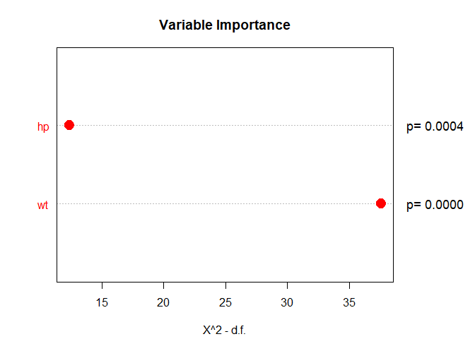

<!-- README.md is generated from README.Rmd. Please edit that file -->

# ham

<!-- badges: start -->
<!-- badges: end -->

The goal of ham is to provide different modeling approaches to
evaluating healthcare programs (or programs in other fields) with
regression analysis. This includes standard regression methods like
linear (OLS) and logistic regression. And ham adds options for
differences-in-differences models as well as interrupted time-series
analysis. DID and ITS models offer options for causal modeling. What is
unique about ham is that it creates datasets with constructed variables
for DID and ITS models, optionally can add top coded outcome variables,
propensity scores, and provides some interpretation of model results.
Additionally, Cronbach’s alpha can be calculated for such things as
patient surveys.

## Installation

You can install the development version of ham from
[GitHub](https://github.com/) with:

``` r
# install.packages("devtools")
devtools::install_github("szuniga07/ham")
```

## Example

These are 2 basic examples of adding propensity scores and topcoding of
outcomes. And an example of calculating Cronbach’s alpha:

``` r
library(ham)
## ordinary least squares: intercept with top coding los and propensity score
summary(assess(formula=los ~ month+program, data=hosprog, intervention = "program", regression="ols", topcode=17.1, propensity= c("female","age","risk"))$model)
#> 
#> Call:
#> stats::lm(formula = primary_formula, data = combined_df)
#> 
#> Residuals:
#>     Min      1Q  Median      3Q     Max 
#> -7.7269 -2.6255 -0.7365  2.0675 11.6016 
#> 
#> Coefficients:
#>              Estimate Std. Error t value Pr(>|t|)    
#> (Intercept)  21.05291    2.70126   7.794 2.29e-14 ***
#> month        -0.54441    0.04072 -13.370  < 2e-16 ***
#> program      -1.18687    0.28846  -4.115 4.33e-05 ***
#> pscore      -25.67785    6.88815  -3.728 0.000208 ***
#> ---
#> Signif. codes:  0 '***' 0.001 '**' 0.01 '*' 0.05 '.' 0.1 ' ' 1
#> 
#> Residual standard error: 3.765 on 716 degrees of freedom
#> Multiple R-squared:  0.2207, Adjusted R-squared:  0.2175 
#> F-statistic: 67.61 on 3 and 716 DF,  p-value: < 2.2e-16

## Cronbach's alpha
alpha(items=c("i1","i2","i3","i4","i5"), data=cas)
#> Scale statistics 
#> Cronbach's alpha   = 0.919 
#> Mean               = 3.772 
#> Variance           = 0.453 
#> Standard Deviation = 0.673 
#> Items              = 5 
#>  
#> Item statistics 
#>    Mean Variance Std. Dev.
#> i1 3.50    0.434     0.659
#> i2 3.81    0.681     0.825
#> i3 3.88    0.652     0.808
#> i4 3.82    0.594     0.770
#> i5 3.85    0.634     0.796
#> 
#> Scale statistics if item deleted 
#>    Alpha  Mean Variance Std. Dev.
#> i1 0.930 3.840    0.528     0.727
#> i2 0.891 3.763    0.436     0.660
#> i3 0.883 3.745    0.433     0.658
#> i4 0.910 3.760    0.472     0.687
#> i5 0.885 3.752    0.439     0.662
#> 
#> Sample 
#> Total    = 100 
#> Valid    = 100 
#> Excluded = 0
```

This is an example of a differences-in-differences model, the key
variable is DID:

``` r
summary(assess(formula=los ~ ., data=hosprog, intervention = "program",
       int.time="month", treatment = 5, did="two")$DID)
#> 
#> Call:
#> stats::lm(formula = DID_formula, data = combined_df)
#> 
#> Residuals:
#>    Min     1Q Median     3Q    Max 
#> -8.402 -3.050 -0.822  1.457 43.184 
#> 
#> Coefficients:
#>             Estimate Std. Error t value Pr(>|t|)    
#> (Intercept)  10.2083     0.4550  22.437  < 2e-16 ***
#> Post.All     -3.2865     0.5403  -6.083 1.92e-09 ***
#> Int.Var       0.2292     0.6660   0.344 0.730903    
#> DID          -2.8697     0.8284  -3.464 0.000563 ***
#> ---
#> Signif. codes:  0 '***' 0.001 '**' 0.01 '*' 0.05 '.' 0.1 ' ' 1
#> 
#> Residual standard error: 5.148 on 716 degrees of freedom
#> Multiple R-squared:  0.1649, Adjusted R-squared:  0.1614 
#> F-statistic: 47.14 on 3 and 716 DF,  p-value: < 2.2e-16
```

Here is a mtcars mpg example of a variable importance plot which can
help provide focus on which are the most important variables to
consider. Higher chi-square indicates higher importance. Significant
results are highlighted in red:

``` r
plot(importance(assess(mpg ~ hp+wt, data=mtcars, regression= "ols")$model))
```



Interrupted time-series models are also available.
