<!-- README.md is generated from README.Rmd. Please edit that file -->

# Healthcare Analysis Methods (ham)

<!-- badges: start -->
<!-- badges: end -->

The goal of ham is to provide different modeling approaches to
evaluating healthcare programs (or programs in other fields) with
regression analysis. This includes standard regression methods like
linear (OLS) and logistic regression. And ham adds options for
differences-in-differences models as well as interrupted time-series
analysis. DID and ITS models offer options for causal modeling. What is
unique about ham is that it creates datasets with constructed variables
for DID and ITS models, optionally it can add top coded outcome
variables, propensity scores, and provides some interpretation of model
results. Additionally, Cronbach’s alpha can be calculated for such
things as patient surveys. As the logo of Dr. Ham suggests, the ham
package can help illuminate your results.


## Installation

You can install the development version of ham from
[GitHub](https://github.com/) with:

``` r
# install.packages("devtools")
devtools::install_github("szuniga07/ham")
```

## Cronbach’s alpha example

An example of calculating Cronbach’s alpha:

``` r
library(ham)
alpha(items=c("i1","i2","i3","i4","i5"), data=cas)
#> Scale statistics 
#> Cronbach's alpha   = 0.919 
#> Mean               = 3.772 
#> Variance           = 0.453 
#> Standard Deviation = 0.673 
#> Items              = 5 
#>  
#> Item statistics 
#>    Mean Variance Std. Dev.
#> i1 3.50    0.434     0.659
#> i2 3.81    0.681     0.825
#> i3 3.88    0.652     0.808
#> i4 3.82    0.594     0.770
#> i5 3.85    0.634     0.796
#> 
#> Scale statistics if item deleted 
#>    Alpha  Mean Variance Std. Dev.
#> i1 0.930 3.840    0.528     0.727
#> i2 0.891 3.763    0.436     0.660
#> i3 0.883 3.745    0.433     0.658
#> i4 0.910 3.760    0.472     0.687
#> i5 0.885 3.752    0.439     0.662
#> 
#> Sample 
#> Total    = 100 
#> Valid    = 100 
#> Excluded = 0

## Interpret the results
interpret(alpha(items=c("i1","i2","i3","i4","i5"), data=cas))
#> Interpretations: Alpha 
#> ---------------------- 
#> Your 5 item scale has a Cronbach's alpha of 0.919. This is 
#> generally considered as being in the 'excellent' range. 
#> 
#> The scale mean is 3.77 and has a standard deviation of 0.673. 
#> 
#> Removing one of these item(s): i1, can improve the Cronbach's 
#> alpha in a new scale to a higher level than the current alpha 
#> based on all items. 
#> 
#> 0 row(s) of data excluded from the analysis because of missing 
#> data.
```

## 1. Introduction

This is the ham package on healthcare analysis methods. This package can
help when performing program evaluations or intervention studies in
healthcare. Or simply to test if a program has an impact on an outcome
of interest.

ham can help with research or evaluation studies. When working in
healthcare systems, multi-site evaluations can strongly resemble
research studies and commonly use regression methods. For an
introduction to evaluation, please see the reference below.

Patton, M. Q. (1997). Utilization-focused evaluation: The new century
text (3rd ed.). Thousand Oaks, CA: Sage Publications

What is unique about ham, is that it provides options for running
standard linear or ordinary least squares (OLS) and logistic regression
as well as methods used in causal modeling such as
differences-in-differences (DID) and interrupted time series analysis
(ITS). It also optionally makes data with the newly created variables
(i.e., this saves you time).

This vignette will introduce ham’s features in the following functions:
\* alpha: Conduct Cronbach’s alpha on scale items (e.g., survey
questions). \* assess: Perform various regression methods (OLS,
logistic, differences-in-differences, and interrupted time series) \*
importance: Rank variable importance from regression coefficients using
the partial chi-square statistic. \* interpret: Provides simple
coefficient interpretations. This is a helpful reminder, especially as
models have increased coefficients (e.g., ITS). \* There are also
printing and plotting options to help review your results.

Below will cover 3 sections with examples of the different features
along the way.

## 2. Descriptive and inferential statistics

This example shows group level point estimates and confidence intervals.
There is also an option to retrieve those estimates over time periods.
And there are graphing options to help see how the data looks for both.

Results can be returned for each unit of time, as increments such as for
each 3 months (i.e., quarters) or for rolling averages such as a rolling
12-month period. Using increments of multiple months or as rolling
averages can help visualize results when there is high variation over
time.

### Group level 95% confidence intervals with: 1) 3-month increments, and 2) 6-month rolling averages

``` r
gr1 <- group(x="program", y="los", z="month", data=hosprog, dist="t", increment=3, rolling=6)
print(gr1$Group.CI)
#> $adf_alpha
#>   Group PointEst    Lower    Upper
#> 1     1 4.247012 4.034842 4.459181
#> 0     0 4.585967 4.391132 4.780802
#> 
#> $adf_numeric
#>   Group PointEst    Lower    Upper
#> 0     0 4.585967 4.391132 4.780802
#> 1     1 4.247012 4.034842 4.459181
#> 
#> $adf_all
#>   PointEst    Lower    Upper
#> 1 4.428259 4.284543 4.571974
```

### Graph the results

``` r
plot(x=gr1, y="group", order="numeric", lwd=4, gcol= "blue", pcol="red", overall=TRUE, oband=TRUE, ocol="gray", tcol="green", tgt=4.5, cex=2, cex.axis=1, cex.lab=1.1, cex.text=2, cex.main=1.25, adj.alpha=.2)
```

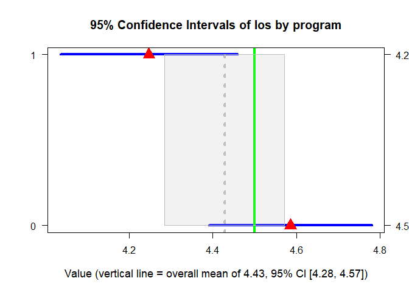

### Graph the trend results with averages based on 3 month increments

``` r
plot(x=gr1, y="time", lwd=4, gcol=c("red", "blue"), gband=TRUE, overall=TRUE, oband=TRUE, ocol="gray", tcol="green", tgt=4, tpline=3, tpcol="yellow", name=TRUE, cex.axis=1, cex.lab=1, cex.text=2, cex.main=1.25, adj.alpha=.3)
```

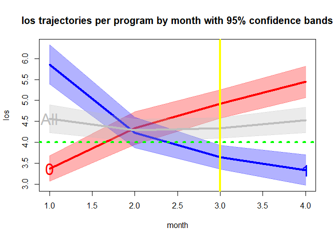

## 3. Linear and logistic regression

The example dataset has common variables found in program evaluation or
intervention studies (I’ll refer to both as a ‘study’), there are
various outcome and predictor variables (or response and explanatory
variables or dependent and independent variables or other names common
in your field). In these studies, we try to assess the impact of the
predictors on the outcome. We often use treatment and control groups to
asses a healthcare program or intervention’s impact on our key outcome
variable of interest. Because of multiple stakeholders, we often conduct
these studies with multiple outcomes to help answer the multiple
stakeholder’s questions.

A common approach to answering study questions is using a regression to
test a treatment effect while controlling for other covariates.

Here are OLS and logistic regression example using assess() on the
mtcars data. These use lm() and glm() found in R’s stats package.

### OLS or linear regression

``` r
summary(assess(hp ~ mpg+wt, data=mtcars, regression="ols")$model)
#> 
#> Call:
#> stats::lm(formula = primary_formula, data = combined_df, weights = wght_obj, 
#>     offset = offst_obj)
#> 
#> Residuals:
#>    Min     1Q Median     3Q    Max 
#> -59.42 -30.75 -12.07  24.82 141.84 
#> 
#> Coefficients:
#>             Estimate Std. Error t value Pr(>|t|)   
#> (Intercept)  349.287    103.509   3.374  0.00212 **
#> mpg           -9.417      2.676  -3.519  0.00145 **
#> wt            -4.168     16.485  -0.253  0.80217   
#> ---
#> Signif. codes:  0 '***' 0.001 '**' 0.01 '*' 0.05 '.' 0.1 ' ' 1
#> 
#> Residual standard error: 44.65 on 29 degrees of freedom
#> Multiple R-squared:  0.6033, Adjusted R-squared:  0.576 
#> F-statistic: 22.05 on 2 and 29 DF,  p-value: 1.505e-06
```

### Logistic regression

``` r
summary(assess(formula=vs~mpg+wt+hp, data=mtcars, regression="logistic")$model)
#> 
#> Call:
#> stats::glm(formula = primary_formula, family = binomial(link = family_link), 
#>     data = combined_df, weights = wght_obj, offset = offst_obj)
#> 
#> Coefficients:
#>              Estimate Std. Error z value Pr(>|z|)  
#> (Intercept) -10.61945   16.52453  -0.643   0.5205  
#> mpg           0.50291    0.48656   1.034   0.3013  
#> wt            3.87749    3.19255   1.215   0.2245  
#> hp           -0.09318    0.04318  -2.158   0.0309 *
#> ---
#> Signif. codes:  0 '***' 0.001 '**' 0.01 '*' 0.05 '.' 0.1 ' ' 1
#> 
#> (Dispersion parameter for binomial family taken to be 1)
#> 
#>     Null deviance: 43.860  on 31  degrees of freedom
#> Residual deviance: 14.748  on 28  degrees of freedom
#> AIC: 22.748
#> 
#> Number of Fisher Scoring iterations: 8

## Interpret the results
interpret(assess(formula=vs~mpg+wt+hp, data=mtcars, regression="logistic")
          )$model
#> Interpretations: Regression model 
#> ---------------------- 
#> These estimates tell you about the relationship between the 
#> independent variables and the dependent variable. These estimates 
#> tell the amount of change in outcome scores that would be 
#> predicted by a 1 unit increase in the predictor. 
#> 
#> The following predictor variable(s) have coefficient(s) 
#> significantly different from 0 using an alpha of 0.05:
#> hp 
#> 
#> For every 1 unit increase in these predictor variables,
#> vs is predicted to increase by the value of the 
#> coefficient, holding all other variables constant. The following 
#> predictor variable(s) have positive coefficient(s) that 
#> increase the predicted value and odds of the outcome: 
#> No positive coefficients in your model were significant. 
#> 
#> For every 1 unit increase in these predictor variables,
#> vs is predicted to decrease by the value of the 
#> coefficient, holding all other variables constant. The following 
#> predictor variable(s) have negative coefficient(s) that 
#> decrease the predicted value and odds of the outcome: 
#> hp (8.9% decreased odds) 
#> 
#> There is no R2 or C-statistic (AUC) information provided.
```

ham can topcode the outcome and create a propensity score variable. Here
is an example using the artificially created hosprog data with hospital
stay cost as the outcome with a novel hospital program/intervention
binary indicator and a 12 month time variable. The option for new data
being returned is specified with newdata=TRUE.

### OLS topcoding

top coding cost at \$17,150 and propensity score based on age, female
indicator, and a health risk probability score.

``` r
m1 <- assess(formula=cost ~ month * program, data=hosprog, intervention = "program",
regression="ols", topcode=17150, propensity=c("female","age","risk"),
newdata=TRUE)
```

### Model results

``` r
summary(m1$model)
#> 
#> Call:
#> stats::lm(formula = primary_formula, data = combined_df, weights = wght_obj, 
#>     offset = offst_obj)
#> 
#> Residuals:
#>     Min      1Q  Median      3Q     Max 
#> -6570.9 -2158.3  -598.1  1962.0 10521.1 
#> 
#> Coefficients:
#>                Estimate Std. Error t value Pr(>|t|)    
#> (Intercept)    14006.64    1363.65  10.271  < 2e-16 ***
#> month            424.81      46.57   9.122  < 2e-16 ***
#> program         5524.74     514.18  10.745  < 2e-16 ***
#> pscore        -15989.00    2838.57  -5.633 2.55e-08 ***
#> month:program   -908.68      68.64 -13.239  < 2e-16 ***
#> ---
#> Signif. codes:  0 '***' 0.001 '**' 0.01 '*' 0.05 '.' 0.1 ' ' 1
#> 
#> Residual standard error: 3165 on 715 degrees of freedom
#> Multiple R-squared:  0.233,  Adjusted R-squared:  0.2287 
#> F-statistic:  54.3 on 4 and 715 DF,  p-value: < 2.2e-16
```

Descriptive statistics on newly created variables and the original cost
as a comparison. top.cost is the topcoded cost variable.

``` r
summary(m1$newdata[, c( "cost","top.cost", "pscore")])
#>       cost          top.cost         pscore      
#>  Min.   : 1483   Min.   : 1483   Min.   :0.3708  
#>  1st Qu.: 6410   1st Qu.: 6410   1st Qu.:0.4364  
#>  Median : 8639   Median : 8639   Median :0.4655  
#>  Mean   : 9348   Mean   : 9215   Mean   :0.4653  
#>  3rd Qu.:11487   3rd Qu.:11487   3rd Qu.:0.4942  
#>  Max.   :27540   Max.   :17150   Max.   :0.5609
```

### importance

We can examine variable importance based on partial chi-square (i.e.,
which variables explain the outcome the most).

``` r
importance(m1$model)
#>               X    Chi.Sq d.f.      p.value
#> 1         month 175.30630    2 8.564878e-39
#> 2       program 179.92844    2 8.492485e-40
#> 3        pscore  31.72813    1 1.773352e-08
#> 4 month:program 175.27159    1 5.222734e-40
```

### Plot importance

We can examine variable importance to see a ranking of variables with a
graph. The hospital program has the highest rank, variables highlighted
in red are statistically significant.

``` r
#Consider using these graphical parameters
par(mar=c(4.2, 2, 3.5, 3))
par(oma = c(0, 0, 0, 3))
plot(importance(m1$model))
```

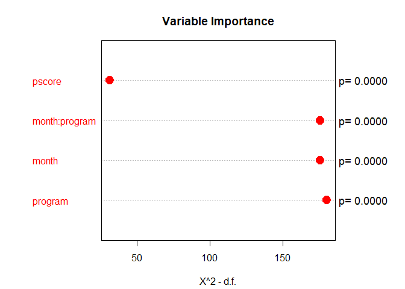

Topcoding can be applied to any model. Propensity scores can be created
for any model except the single group interrupted time series because
there is no control group (i.e. intervention group only).

## 4. Differences-in-Differences

DID can be used on binary or continuous outcome variables. Below is an
example using the hosprog data with length of stay as the outcome and
the created DID variables as the predictors, use ‘.’ on the right-hand
side of the formula to indicate only the created variables will be used.
Replace ‘.’ with any additional selected variables. The newly created
DID variables will be added in all DID models. This model has a pre/post
design (i.e., there are only 2 distinct time points) by selecting:
did=“two”, with post starting at month 5.

### DID model 1

``` r
dm1 <- assess(formula= los ~ ., data=hosprog, intervention = "program",
              int.time="month", treatment= 5, did="two")
```

### View DID model results

``` r
summary(dm1$DID)
#> 
#> Call:
#> stats::lm(formula = DID_formula, data = combined_df, weights = wght_obj, 
#>     offset = offst_obj)
#> 
#> Residuals:
#>     Min      1Q  Median      3Q     Max 
#> -3.6247 -1.2003 -0.3145  0.8564  8.8642 
#> 
#> Coefficients:
#>             Estimate Std. Error t value Pr(>|t|)    
#> (Intercept)   3.4940     0.1650  21.175  < 2e-16 ***
#> Post.All      1.5629     0.1974   7.917 9.25e-15 ***
#> Int.Var       2.0664     0.2349   8.797  < 2e-16 ***
#> DID          -3.5448     0.2849 -12.444  < 2e-16 ***
#> ---
#> Signif. codes:  0 '***' 0.001 '**' 0.01 '*' 0.05 '.' 0.1 ' ' 1
#> 
#> Residual standard error: 1.777 on 716 degrees of freedom
#> Multiple R-squared:  0.1848, Adjusted R-squared:  0.1814 
#> F-statistic: 54.11 on 3 and 716 DF,  p-value: < 2.2e-16
```

### Coefficient interpretations

``` r
interpret(dm1)$did
#> Interpretations: DID 
#> -------------------- 
#> The intercept represents the mean los value of the 
#> control group at the baseline period (Time 1): 3.49. 
#> 
#> Post.All is the change in the control group's los 
#> value in the 2nd time period (Time 2). There is a 
#> significant increase for the control group 
#> at time 2: 1.56. 
#> 
#> Int.Var is the difference between the intervention 
#> and control group at the baseline period (Time 1). The 
#> intervention group had a significant increase in the 
#> mean los value compared to the control group: 2.07. 
#> 
#> DID estimates the average treatment effect on the 
#> treated group (ATET). This interaction represents the 
#> difference in the trend differences for the intervention and 
#> control groups: 
#> (Int. Time 2 - Int. Time 1) - (Ctl. Time 2 - Ctl. Time 1) = -3.54.  
#> In other words, there is a significant decrease in the 
#> mean los trend by -3.54 for the intervention group. 
#> 
#> If there are additional variables in the model then the coefficients 
#> above represent the effects after controlling for the other variables.
```

### DID model 2

This model allows for more than 2 time points. It allows for monthly
increments by selecting did=“many”.

``` r
dm2 <- assess(formula= los ~ ., data=hosprog, intervention = "program",
              int.time="month", treatment= 5, did="many")
```

### View DID model 2 results

``` r
summary(dm2$DID)
#> 
#> Call:
#> stats::lm(formula = DID_formula, data = combined_df, weights = wght_obj, 
#>     offset = offst_obj)
#> 
#> Residuals:
#>     Min      1Q  Median      3Q     Max 
#> -3.7149 -1.2747 -0.3732  0.8838  9.1718 
#> 
#> Coefficients:
#>             Estimate Std. Error t value Pr(>|t|)    
#> (Intercept)  4.17164    0.16049  25.994  < 2e-16 ***
#> Period       0.10837    0.02342   4.627  4.4e-06 ***
#> DID          0.14843    0.48630   0.305 0.760284    
#> DID.Trend   -0.19580    0.05712  -3.428 0.000643 ***
#> ---
#> Signif. codes:  0 '***' 0.001 '**' 0.01 '*' 0.05 '.' 0.1 ' ' 1
#> 
#> Residual standard error: 1.853 on 716 degrees of freedom
#> Multiple R-squared:  0.1135, Adjusted R-squared:  0.1098 
#> F-statistic: 30.57 on 3 and 716 DF,  p-value: < 2.2e-16
```

### Get coefficient interpretations

``` r
interpret(dm2)$did
#> Interpretations: DID 
#> -------------------- 
#> The intercept represents the starting point of the control 
#> group's trend line at the baseline period (Time 1): 4.17. 
#> 
#> Period is the change in the control group's los value trend 
#> line after the baseline period. There is a significant increase 
#> for the control group after the baseline period: 0.108. 
#> 
#> DID estimates the difference in mean overall level between 
#> the intervention and both the non-intervention period/group. 
#> In other words, there is a non-significant increase in the 
#> mean los by 0.148 for the intervention group. 
#> 
#> DID.Trend is the difference in the intervention group's 
#> trend line after the intervention period started (> Time 1). 
#> The intervention group had a significant decrease in trend 
#> of the mean los by -0.196 after the intervention started. 
#> 
#> If there are additional variables in the model then the coefficients 
#> above represent the effects after controlling for the other variables.
```

We can also use DID on binary outcomes like hospital re-admission within
30-days.

``` r
dm3 <- assess(formula= rdm30 ~ ., data=hosprog, intervention = "program",
              int.time="month", treatment= 5, did="two")
```

### View DID model 3 results

``` r
summary(dm3$DID)
#> 
#> Call:
#> stats::lm(formula = DID_formula, data = combined_df, weights = wght_obj, 
#>     offset = offst_obj)
#> 
#> Residuals:
#>      Min       1Q   Median       3Q      Max 
#> -0.31858 -0.25651 -0.07207 -0.06034  0.93966 
#> 
#> Coefficients:
#>             Estimate Std. Error t value Pr(>|t|)    
#> (Intercept)  0.06034    0.03422   1.763   0.0782 .  
#> Post.All     0.19616    0.04094   4.792 2.01e-06 ***
#> Int.Var      0.25824    0.04871   5.301 1.53e-07 ***
#> DID         -0.44267    0.05907  -7.493 1.98e-13 ***
#> ---
#> Signif. codes:  0 '***' 0.001 '**' 0.01 '*' 0.05 '.' 0.1 ' ' 1
#> 
#> Residual standard error: 0.3686 on 716 degrees of freedom
#> Multiple R-squared:  0.0759, Adjusted R-squared:  0.07203 
#> F-statistic:  19.6 on 3 and 716 DF,  p-value: 3.197e-12
```

Significant DID effect showing reduced re-admissions

## 5. Interrupted Time Series

ITS lets us look at trends for 1 or 2 groups such as an
intervention/treatment group without a control group or both a treatment
and control group. And we have the option of one or more treatment
periods (or interruptions). This gives us 4 options that can be
specified using the interrupt and its= arguments.

Below are examples using the hosprog data for the patient length of stay
(LOS) and death within 30-days. The dataset hosp1 will be used for the
single group examples.

We begin by looking at a single group with a single
interruption/treatment period and assessing their LOS scores. We specify
it with: interrupt= 5 and its=“one”.

### ITS model 1

``` r
im11 <- assess(formula=los ~ ., data=hosp1, intervention = "program",
               int.time="month", interrupt= 5, its="one")
```

### View ITS model 1 results

``` r
summary(im11$ITS)
#> 
#> Call:
#> stats::lm(formula = ITS_formula, data = combined_df, weights = wght_obj, 
#>     offset = offst_obj)
#> 
#> Residuals:
#>     Min      1Q  Median      3Q     Max 
#> -3.7673 -1.1321 -0.3755  0.5758  9.1718 
#> 
#> Coefficients:
#>             Estimate Std. Error t value Pr(>|t|)    
#> (Intercept)   6.3299     0.4170  15.178   <2e-16 ***
#> ITS.Time     -0.2889     0.1442  -2.003   0.0460 *  
#> post5        -1.0026     0.4264  -2.351   0.0193 *  
#> txp5          0.2014     0.1522   1.324   0.1865    
#> ---
#> Signif. codes:  0 '***' 0.001 '**' 0.01 '*' 0.05 '.' 0.1 ' ' 1
#> 
#> Residual standard error: 1.726 on 331 degrees of freedom
#> Multiple R-squared:  0.2426, Adjusted R-squared:  0.2357 
#> F-statistic: 35.34 on 3 and 331 DF,  p-value: < 2.2e-16
```

### interpret coefficients

``` r
interpret(im11)$its
#> Interpretations: ITS 
#> -------------------- 
#> Note: Some variable names below based on time points (or 'interruptions'). 
#> This analysis is for a one-group, single intervention period (interruption). 
#> 
#> Intercept is 6.33 and the starting value of the trend 
#> for the intervention group. 
#> 
#> ITS.Time is -0.289 and the slope prior to intervention. 
#> The coefficient is significant. 
#> 
#> post5 is -1 and the immediate shift in the trend line 
#> after the intervention start (e.g., 1st year of intervention). 
#> The coefficient is significant. 
#> 
#> txp5 is 0.201 and the difference between pre- and 
#> post-intervention slopes (e.g., change in the pre-intervention 
#> slope). The coefficient is non-significant. 
#> 
#> Summary: The results show that after the start of the intervention, 
#> there is a non-significant change in the los trend. This gives 
#> a post-intervention trend change per time unit in the los of -0.0874 
#> (i.e., the value of change per-unit-of-time, such as month or year, in 
#> the intervention period; not the change relative to pre-intervention). 
#> 
#> If there are additional variables in the model then the coefficients 
#> above represent effects after controlling for the other variables.
```

There is a second key period of interest at month 9 which is specified
with interrupt= c(5, 9) and its=“one”

### ITS model 2

``` r
im12 <- assess(formula=los ~ ., data=hosp1, intervention = "program",
               int.time="month", interrupt= c(5, 9), its="one")
```

### View ITS model 2 results

``` r
summary(im12$ITS)
#> 
#> Call:
#> stats::lm(formula = ITS_formula, data = combined_df, weights = wght_obj, 
#>     offset = offst_obj)
#> 
#> Residuals:
#>     Min      1Q  Median      3Q     Max 
#> -3.7673 -1.1571 -0.2641  0.5841  8.8966 
#> 
#> Coefficients:
#>             Estimate Std. Error t value Pr(>|t|)    
#> (Intercept)   6.3299     0.4157  15.226   <2e-16 ***
#> ITS.Time     -0.2889     0.1438  -2.009   0.0453 *  
#> post5        -0.9877     0.4569  -2.161   0.0314 *  
#> txp5          0.2517     0.2051   1.227   0.2207    
#> post9        -0.7806     0.5100  -1.530   0.1269    
#> txp9          0.2296     0.2114   1.086   0.2781    
#> ---
#> Signif. codes:  0 '***' 0.001 '**' 0.01 '*' 0.05 '.' 0.1 ' ' 1
#> 
#> Residual standard error: 1.72 on 329 degrees of freedom
#> Multiple R-squared:  0.2519, Adjusted R-squared:  0.2405 
#> F-statistic: 22.16 on 5 and 329 DF,  p-value: < 2.2e-16
```

We continue with comparing the intervention and control groups on their
LOS scores which is specified with interrupt= 5 and its=“two”.

### ITS model 3

``` r
im21 <- assess(formula=los ~ ., data=hosprog, intervention = "program",
               int.time="month", interrupt= 5, its="two")
```

### View ITS model 3 results

``` r
summary(im21$ITS)
#> 
#> Call:
#> stats::lm(formula = ITS_formula, data = combined_df, weights = wght_obj, 
#>     offset = offst_obj)
#> 
#> Residuals:
#>     Min      1Q  Median      3Q     Max 
#> -3.7673 -1.1722 -0.3348  0.8794  9.1718 
#> 
#> Coefficients:
#>             Estimate Std. Error t value Pr(>|t|)    
#> (Intercept)   3.0896     0.3951   7.821 1.90e-14 ***
#> ITS.Time      0.1635     0.1455   1.123   0.2617    
#> ITS.Int       3.2403     0.5790   5.596 3.13e-08 ***
#> txi          -0.4523     0.2064  -2.191   0.0287 *  
#> post5         0.4413     0.4508   0.979   0.3279    
#> txp5          0.0297     0.1530   0.194   0.8462    
#> ixp5         -1.4439     0.6249  -2.311   0.0211 *  
#> txip5         0.1717     0.2174   0.790   0.4299    
#> ---
#> Signif. codes:  0 '***' 0.001 '**' 0.01 '*' 0.05 '.' 0.1 ' ' 1
#> 
#> Residual standard error: 1.752 on 712 degrees of freedom
#> Multiple R-squared:  0.2124, Adjusted R-squared:  0.2046 
#> F-statistic: 27.43 on 7 and 712 DF,  p-value: < 2.2e-16
```

We have an interest in a 2nd interruption at month 9, which is specified
with interrupt= c(5, 9) and its=“two”.

### ITS model 4

``` r
im22 <- assess(formula=los ~ ., data=hosprog, intervention = "program",
               int.time="month", interrupt= c(5, 9), its="two")
```

### View ITS model 4 results

``` r
summary(im22$ITS)
#> 
#> Call:
#> stats::lm(formula = ITS_formula, data = combined_df, weights = wght_obj, 
#>     offset = offst_obj)
#> 
#> Residuals:
#>     Min      1Q  Median      3Q     Max 
#> -3.7673 -1.1755 -0.2888  0.9020  8.8966 
#> 
#> Coefficients:
#>             Estimate Std. Error t value Pr(>|t|)    
#> (Intercept)  3.08956    0.39418   7.838 1.68e-14 ***
#> ITS.Time     0.16346    0.14519   1.126   0.2606    
#> ITS.Int      3.24031    0.57773   5.609 2.92e-08 ***
#> txi         -0.45232    0.20594  -2.196   0.0284 *  
#> post5        0.59672    0.47463   1.257   0.2091    
#> txp5        -0.03780    0.20378  -0.186   0.8529    
#> ixp5        -1.58438    0.66393  -2.386   0.0173 *  
#> txip5        0.28951    0.29147   0.993   0.3209    
#> post9       -0.21293    0.46895  -0.454   0.6499    
#> txp9         0.28005    0.19285   1.452   0.1469    
#> ixp9        -0.56762    0.69886  -0.812   0.4169    
#> txip9       -0.05043    0.28863  -0.175   0.8613    
#> ---
#> Signif. codes:  0 '***' 0.001 '**' 0.01 '*' 0.05 '.' 0.1 ' ' 1
#> 
#> Residual standard error: 1.748 on 708 degrees of freedom
#> Multiple R-squared:  0.2203, Adjusted R-squared:  0.2081 
#> F-statistic: 18.18 on 11 and 708 DF,  p-value: < 2.2e-16
```

### View a partial prediction plot

``` r
plot(x=im22, y="ITS", ylim=c(2, 8), add.legend="bottomleft")
```

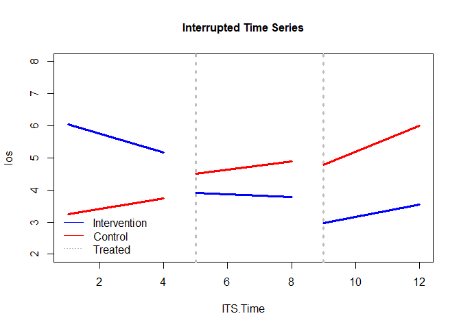

We can also perform an ITS on binary outcomes like death within 30-days.
We will examine an intervention and control group at months 5 and 9,
which is specified with interrupt= c(5, 9) and its =“two”.

### ITS model 5

``` r
id22 <- assess(formula=death30 ~ ., data=hosprog, intervention = "program",
               int.time="month", interrupt= c(5, 9), its="two")
```

### View ITS model 5 results

``` r
summary(id22$ITS)
#> 
#> Call:
#> stats::lm(formula = ITS_formula, data = combined_df, weights = wght_obj, 
#>     offset = offst_obj)
#> 
#> Residuals:
#>      Min       1Q   Median       3Q      Max 
#> -0.26332 -0.19587 -0.08391 -0.04646  0.95377 
#> 
#> Coefficients:
#>              Estimate Std. Error t value Pr(>|t|)  
#> (Intercept)  0.082862   0.075334   1.100   0.2717  
#> ITS.Time    -0.009101   0.027748  -0.328   0.7430  
#> ITS.Int      0.181411   0.110412   1.643   0.1008  
#> txi         -0.013699   0.039359  -0.348   0.7279  
#> post5        0.198078   0.090709   2.184   0.0293 *
#> txp5        -0.026453   0.038946  -0.679   0.4972  
#> ixp5        -0.302124   0.126886  -2.381   0.0175 *
#> txip5        0.071580   0.055704   1.285   0.1992  
#> post9        0.170102   0.089622   1.898   0.0581 .
#> txp9        -0.014163   0.036857  -0.384   0.7009  
#> ixp9        -0.306371   0.133562  -2.294   0.0221 *
#> txip9        0.020050   0.055162   0.363   0.7164  
#> ---
#> Signif. codes:  0 '***' 0.001 '**' 0.01 '*' 0.05 '.' 0.1 ' ' 1
#> 
#> Residual standard error: 0.334 on 708 degrees of freedom
#> Multiple R-squared:  0.05044,    Adjusted R-squared:  0.03569 
#> F-statistic: 3.419 on 11 and 708 DF,  p-value: 0.0001208
```

### interpret ITS model 5 results

``` r
interpret(id22)$its
#> Interpretations: ITS 
#> -------------------- 
#> Note: Some variable names below based on time points (or 'interruptions'). 
#> This analysis is for a two-group, single intervention period (interruption). 
#> Positive values indicate higher intervention group values and vice-versa for: 
#> post1, txp1, ixp1, txip1, post2, txp2, ixp2, txip2. 
#> 
#> Intercept is 0.0829 and the starting value of the trend for the 
#> control group. 
#> 
#> ITS.Time is -0.0091 and the control group's slope prior to intervention. 
#> The coefficient is non-significant. 
#> 
#> ITS.Int is 0.181 and the difference in the level between intervention 
#> and control group prior to intervention 1 (intervention - control). 
#> The coefficient is non-significant. 
#> 
#> txi is -0.0137 and the difference between the intervention and 
#> control group's pre-intervention slopes (intervention - control). 
#> The coefficient is non-significant. 
#> 
#> post5 is 0.198 and the immediate shift in the control group trend 
#> line after this intervention time starts. The coefficient is 
#> significant. 
#> 
#> txp5 is -0.0265 and the difference between current and prior intervention 
#> control group slopes (e.g., change in the pre-intervention slope). 
#> The coefficient is non-significant. 
#> 
#> ixp5 is -0.302 and the difference between the intervention and 
#> control groups (intervention - control) in the period immediately 
#> after this intervention started (e.g., 1st year of intervention 1). 
#> The coefficient is significant. 
#> 
#> txip5 is 0.0716 and non-significant. This is the difference in both 
#> group's slope changes since the prior intervention (pre-slopes compared 
#> to post-slopes). For example, both have pre-intervention slopes 
#> of 2, the control group's slope remained the same, therefore the 
#> post 1st intervention slope is 0. And the intervention group's slope 
#> increased by 2, then txip1 = 2 (= 2 - 0). 
#> 
#> post9 is 0.17 and the immediate shift in the control group trend 
#> line after this intervention time starts. The coefficient is 
#> non-significant. 
#> 
#> txp9 is -0.0142 and the difference between current and prior intervention 
#> control group slopes (e.g., change in the pre-intervention slope). 
#> The coefficient is non-significant. 
#> 
#> ixp9 is -0.306 and the difference between the intervention and 
#> control groups (intervention - control) in the period immediately 
#> after this intervention started (e.g., 1st year of intervention 1). 
#> The coefficient is significant. 
#> 
#> txip9 is 0.0201 and non-significant. This is the difference in both 
#> group's slope changes since the prior intervention (pre-slopes compared 
#> to post-slopes). For example, both have pre-intervention slopes 
#> of 2, the control group's slope remained the same, therefore the 
#> post 1st intervention slope is 0. And the intervention group's slope 
#> increased by 2, then txip1 = 2 (= 2 - 0). 
#> 
#> Summary 1: For this intervention period 1, the results show that 
#> the intervention group's non-significant change in death30, 
#> post-intervention is 0.0223 (i.e., value of change per-unit-of-time,
#> such as month or year, in the intervention period; not the change
#> relative to the prior period). The control group's non-significant 
#> change in death30, post-intervention is -0.0356. The non-significant 
#> difference between both groups, per-unit-of-time, is 0.0579. 
#> 
#> Summary 2: For this intervention period 2, the results show that 
#> the intervention group's non-significant change in death30, 
#> post-intervention is 0.0282 (i.e., value of change per-unit-of-time,
#> such as month or year, in the intervention period; not the change
#> relative to the prior period). The control group's significant 
#> change in death30, post-intervention is -0.0497. The significant 
#> difference between both groups, per-unit-of-time, is 0.0779. 
#> 
#> If there are additional variables in the model then the coefficients 
#> above represent effects after controlling for the other variables.
```

<center>

### 6. REVISIONS AND NEW ADDITIONS!

</center>

The following are corrections of errors and additions in the next
version of ham. Plot options were fixed and overlooked additions were
made like x- and y-axis labels, etc.

### plot.group

1.  “main” argument not working, now fixed.
2.  In plot.group, leave an option to graph either as the start or stop
    months for rolling months. Make stop as default
3.  Add option for trend line of already aggregated data (i.e., basic
    trend line) with “asis” = TRUE argument
4.  Add xlab and ylab

### plot.importance

1.  Better plot set up so we can automatically see p-values on right
    margin
2.  cex.txt
3.  cex.label

<center>

## assess and plot.assess update

</center>

The most noticeable change was to add an option to allow as many
interruptions as possible for Interrupted Time Series (ITS)

### ITS unemployment example

``` r
#Key interruption periods
key_time <- c(5, 14, 17, 29, 42, 59, 69, 73, 80,92)
im10 <- assess(formula=rate ~ ., data=unemployment, intervention = "usa",
      int.time="year", its="one", interrupt= key_time, newdata=TRUE)
```

### Graph ITS unemployment example

``` r
plot(im10, "ITS", add.means = TRUE, coefs=TRUE, conf.int=TRUE, 
     adj.alpha= .2, lwd=1.75, col="slategray", tcol= "orange", main="US unemployment rate",
     xlab="Years (1929-2024)", ylab= "Proportion of labor market", cex.main=2, 
     cex.axis = 1.25, cex.lab = 1.25, cex=2, cex.text= .75, pos.text=list("ITS.Time"=4,
"post42"=1,"txp42"=3,"txp92"=3), x.axis=unemployment$Year) 
for(i in 1:length(key_time)) {
  text(key_time[i], .22-(.01*i), cex=.85, labels = 
         paste0(unemployment[ key_time[i], "Year"], ": ", unemployment[ key_time[i], "event"]))
}
```

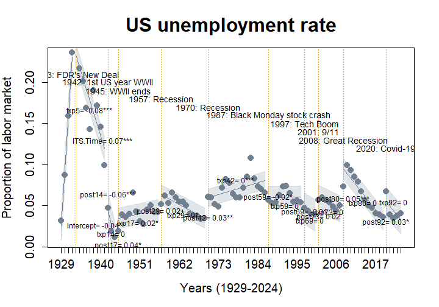

<br>

These and other changes included in version 1.2:

### assess

1.  Create stagger argument for staggered intervention starts for DID
    and ITS
2.  Create function to make multiple interruptions in ITS
3.  Add object for the number of interruptions if it doesn’t already
    exist.
4.  Create stop() for when there are less than 2 time points between
    periods (e.g., interrupt =c(3, 5, 7) works but not interrupt =c(3,
    4, 5). Make suggestion to have at least 3 time points like interrupt
    =c(3, 6, 9)
5.  ITS.Effects are only available for up to 2 interruptions, need it
    for as much as data permits
6.  Subset data

### plot.assess

1.  Create function to make multiple interruptions in ITS
2.  Add in counterfactual for ITS models
3.  xlab and ylab
4.  Added target line(s) and target colors
5.  Added y.axis

### itsEffect

1.  Works for many interruptions

### interpret and print.interpret

1.  Changes for ITS sgmt and mgmt for many interpretations can be as
    many as there are segments.

<br>

### alpha

1.  Fixed missing data issue so that missing does crash the results. If
    I did an alpha for items 1-5 but had missing data within items 6-10,
    I would get NaNs because of my complete.cases argument. Now it will
    only consider items 1-5 so it provides real results.

<br>
<center>

# New functions

</center>

# Bayesian

There are are options for a model summary and graphing. For example,
below is a Posterior Predictive Check on how well our model fits the
data. Estimating center and spread for hospital length of stay. A model
with a gamma likelihood would fit better but this will do for
demonstration purposes.

Other Bayesian options include multilevel summaries and graphs,
posterior distribution summaries, model diagnostics, Gelman R^2 formula,
and target setting.

``` r
blos1 <- Bayes(x=losmcmc)
```

``` r
plot(x=blos1, y="post", parameter=list("sigmaOfY", "muOfY" ),math="divide",
bcol="cyan", HDItext=.3, main= "Coefficient of Variation")
```

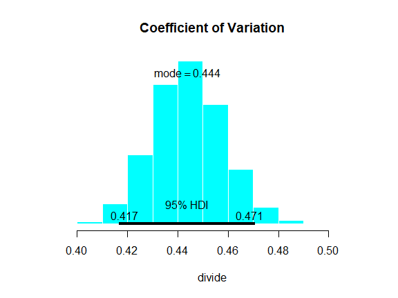

<br>

``` r
plot(x=blos1, y="check", type="n", data=hosprog, dv="los",
parameter=c("muOfY", "sigmaOfY"), breaks=30, cex.axis=1.3, lwd=3, xlab=NULL,
pline=20, vlim=c(-2, 20), xlim=c(-2, 20), add.legend="topright",
main="Length of Stay", cex.main=1.5, xpt=5, pcol="red", lcol="orange",
cex.legend=1, bcol="cyan")
```

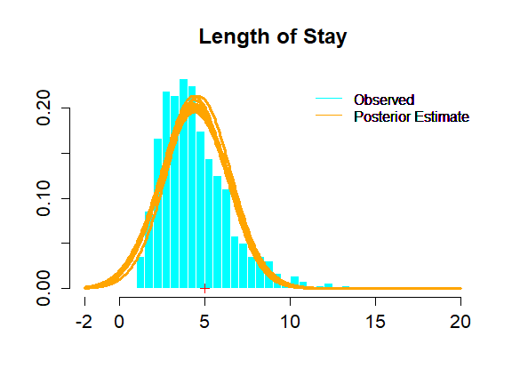

# Control Charts

There are options for Shewhart X-bar charts, p-Charts, and u-Charts.
This includes summary values and the charts. You can do a
before-and-after comparison to see if there is a change too.

u-chart for infection rates with an intervention.

``` r
spc_u <- control(x="HAI", y="PatientDays", time="Month", data=infections,
type="u", n.equal=FALSE, intervention=22)
```

<br>

u-chart with trend lines, various graphing options, x.axis start at 2nd
year and y.axis changed to show HAIs per 1,000 patient days.

``` r
plot(spc_u, main="u-Chart: HAI per 1,000 Patient Days Pre/Post Intervention",
col=c("green","dodgerblue"), trend=TRUE, trcol="red", x.axis=c((1:41+12)), round.c=1,
y.axis=seq(min(spc_u$HAI)*1000, max(spc_u$HAI)*1000, length.out=nrow(spc_u)),
xlab="Months (starting at year 2)", icol="gray", lwd=2, cex=2,
cex.axis=1.1, cex.main=1.25, cex.text=1.25)
```

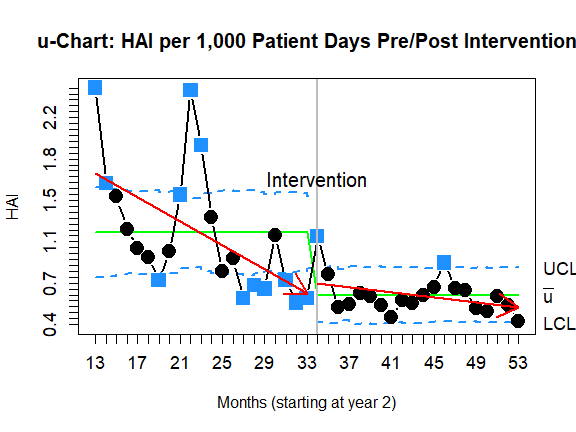

# Decision Curve Analysis and Model Classification

View decision curve analysis results like ‘net benefit’ at various
thresholds of key interest at these percentiles: 0.01, 0.05, 0.10, 0.25,
0.50, 0.75, 0.90, 0.95, 0.99.

We’ll first start of with the model classification graph from a logistic
regression model.

``` r
car_m1 <- assess(formula=vs ~ hp + am, data=mtcars, regression="logistic")
d1 <- decide(x=car_m1, threshold= -0.767)
print(d1$Model.Summary$Classification)
#>     Sensitivity       Specifity False.Positives False.Negatives   Accuracy.Rate 
#>      0.92857143      0.83333333      0.16666667      0.07142857      0.87500000 
#>      Error.Rate 
#>      0.12500000
```

<br>

and next the graph.

``` r
plot(x=d1, y= "cl", cex.lab=.75, bcol=c("cyan", "magenta"), add.legend="topleft", cex.legend=1.5)
```

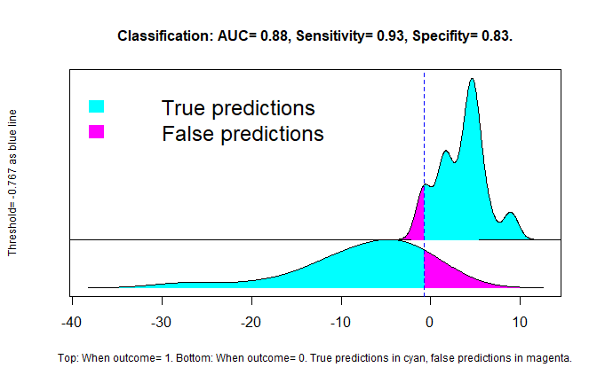

<br>

Now we’ll show ‘Net Benefit’

``` r
plot(x=d1, y= "nb", add.legend="topright", lwd=3, lcol=c("green", "slategray", "red"))
```

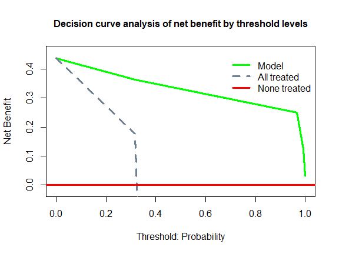

<br>

and then ‘Interventions Saved’

``` r
plot(x=d1, y= "is")
```

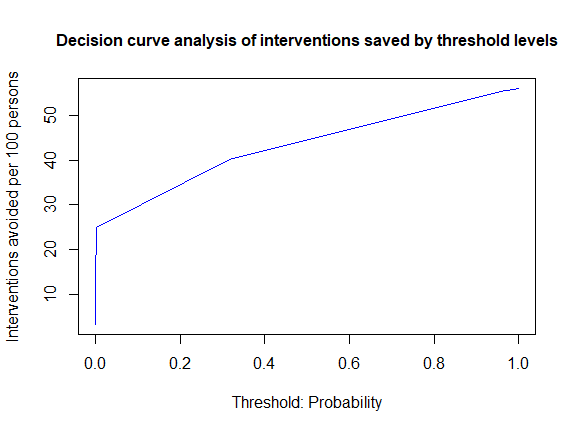

<br>

## Version 1.3 mostly has bug fixes and current feature improvements.

These and other changes included in version 1.3:

New additions

- Digits added to interpret

- Poisson regression added to assess

- Odds ratio added to interpret results for logistic regression

- NHSN data added

- Summary of ITS effects updated for interpretations

- ITS models 3 and 4 updated with graphs and interpretations

- Weights added to assess

- Offset added to assess

- review, print.review, and plot.review added for summarizing regression
  coefficients

- Add x.axis and y.axis examples in ham_package and control vignette

- Bayes() diagnostics and interpretations

- Bayes() target interpretations added and vignette updated

- Interpretations of Bayes diagnostics

- Added Cohen’s h effect sizes to guide Bayesian target analysis

Corrected errors

- Error fixed that significant coefficients weren’t listed in
  interpretations when there is only 1 predictor in the model.

- Fixed y.axis issue for plot.control so that it is no longer
  illogically using the number of x-axis values

- group() no longer adds extra time period in rolling time periods when
  there are NAs in the data frame

- Other missing data issues in different functions

### Graph a summary of the coefficients

This graph will be added in version 1.3 and it is a way to get a review
of the coefficients, showing the direction of the effect with point
estimates and 95% confidence intervals. This was inspired by Frank
Harrell’s plot.summary in the rms package. Instead ham uses plot.review
with the almost identical summary but adds some class information to
help with plotting. This will work on assess regression objects for OLS
linear, logistic, Poisson and models coming from Base R’s lm() and glm()
as well as the survival package and possibly other glm() models. It can
work with Cox Proportional Hazards from the survival package. And this
will work with the differences-in-differences and interrupted time
series models created with assess().

Take a look at the effect when hp is increased by 83.5

``` r
m02 <- assess(formula=mpg ~ wt+hp+am, data=mtcars, regression="ols")
# Using the assess function, notice 'm02$model' object below
print(review(m02$model), digits=4)
#> =================================================
#>                   Model Review
#> =================================================
#>    PointEst    Lower   Upper         P
#> wt -2.87900 -4.73200 -1.0250 0.0035740
#> hp -0.03748 -0.05715 -0.0178 0.0005464
#> am  2.08400 -0.73580  4.9030 0.1413000
#> =================================================
```

let’s see the impactful 83.5 hp increase in going from the 1st to 3rd
quartiles

``` r
m02 <- assess(formula=mpg ~ wt+hp+am, data=mtcars, regression="ols")
plot(x=review(m02$model, increase=c(hp= 83.5)))
```

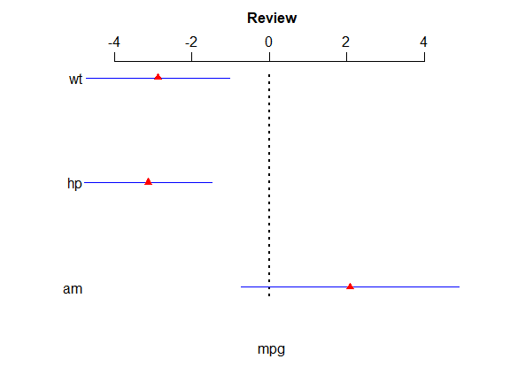

### Bayesian Diagnostics

Here’s a new way to all diagnostics for the parameters with an
interpretation

``` r
blos2 <- Bayes(losmcmc, y="Dx", parameter="muOfY")
interpret(blos2$Diagnostics, digits=5)
#> MCMC Diagnostics 
#> ---------------- 
#> MCMC representativeness: The Gelman-Rubin statistic (shrink factor) measures 
#> the ratio of within- and between-chain variance and is considered as having 
#> a good range of 1.0 to 1.1 with a value of 1.0 indicating the chains are 
#> fully converged and values above 1.1 suggesting the chains have not converged 
#> yet. For MCMC representativeness graphs, please examine trace plots and 
#> density plots found with plot(Bayes()). 
#> 
#> 1. According to the Gelman-Rubin Statistic (GRS) results, your MCMC first 
#> reached the level below 1.1 by about step 100 in the chain. 
#> 
#> 2. The lowest GRS was 1. And 7 of the selected 7 steps between the first 
#> and last steps in the MCMC had Gelman-Rubin statistics below 1.10. 
#> 
#> MCMC accuracy: 1) The autocorrelation factor (ACF) is a measure of chain step 
#> concentration or clustering with values near 0 being ideal (indicating no 
#> clustering) for each chain at various lags (interested in lags 1-20). In 
#> other words, higher ACF indicates that it changes only gradually from step 
#> to step. Values of 0 to 0.05 are essentially the same, very good, with 
#> regards to the ESS formula (see below). 2) The effective sample size (ESS) 
#> tells us the sample size of a completely non-correlated chain that yielded 
#> the same info because we'd like a measure of how much independent info there 
#> is in autocorrelated chains. An ESS value of 10,000 is recommended. Note that 
#> the ESS uses the ACF in its calculations with higher ACF leading to lower ESS. 
#> 3) The Monte Carlo standard error (MCSE) = parameter Std. Dev. / sqrt(ESS) 
#> with values on the parameter scale. If the MCSE is much smaller than the 
#> parameter mean, this indicates a good MCSE. 
#> 
#> 1. Your average Autocorrelation Factor across chains is: 
#> 0.00461, 0.00383, -0.00818, -0.01403, -0.00424 at the 
#> 1st, 5th, 10th, 15th, and 20th lags. 
#> 
#> 2. Your Effective Sample Size is 20000 and is above the ideal target of 10,000 
#> or more for sparse regions of the distributions (e.g., limits of 95% HDIs). 
#> 
#> 3. Your Monte Carlo Standard Error is 0.00052. Please compare this value with 
#> the parameter's average to understand how large or small the MCSE is. 
#> 
#> MCMC efficiency: Please see Kruschke, 2015, to read more about efficiency such 
#> as 1) using different samplers, 2) parallel R, 3) changing parametrizations of 
#> the model, 4) and thinning chains (recording fewer steps). 
#> 
#> Background 
#> ---------- 
#> We have 3 main quality goals when generating MCMC samples from our posterior 
#> distribution: A) Chain values are representative of the posterior and there 
#> is no excessive initial value influence, therefore our chains explore the full 
#> posterior range. B) Chains are sufficiently large for accurate and stable 
#> estimates (e.g., 95% HDI). C) Chains should be efficient in terms of 
#> completion time and computing power. 
#> 
#> MCMC diagnostics help us with most of these goals and allows us to review: 
#> 
#> 1) Visual inspection of trace and density plots, see plot(Bayes()), and the 
#> Gelman-Rubin statistic can suggest whether the burn-in period has been 
#> suitably passed and 
#> 2) suggests whether the chains are well-mixed and representative of the posterior. 
#> 3) Remember these don't guarantee representativeness. 
#> 4) ESS and MCSE suggest how stable and accurate the chains are. 
#> 5) For stability in sparse regions (e.g., 95% HDI limits), ideally ESS >= 10,000. 
#> 6) If you want accuracy in the dense regions of the distribution such as the mean, 
#> a small MCSE may suggest the mean can be estimated very stably even with a low ESS.
```

### Bayesian target analysis

A possible healthcare target analysis with interpretations of results.

``` r
btarget1 <- Bayes(x=losmcmc, y="target", type="n", parameter=c("muOfY","sigmaOfY"),
newdata=TRUE, targets=list(p=c(.35,.4,.45, .5, .55),  y=c(3,4), e= list(a=c(.35,.4,.45), b=.5)))
interpret(btarget1$Target, digits=3)
#> Interpretations: Target 
#> ----------------------- 
#> Based on the cumulative distribution function for P(X <= x), 
#> the following probability is at or less than point x, with 
#> 95% Highest Density Intervals [HDI Low, HDI High]: 
#> The probability of x <= 3 is 0.232 [0.209, 0.259]. 
#> The probability of x <= 4 is 0.416 [0.385, 0.442]. 
#> 
#> The estimated interval of the lowest and highest x values you 
#> listed have this estimated area under the curve between them: 
#> The AUC in the interval of 3 and 4 is 0.18 [0.171, 0.19]. 
#> 
#> Based on the inverse cumulative distribution function for 
#> P(X <= x) = p'th quantile, the following x is at this percentile, 
#> with 95% Highest Density Intervals [HDI Low, HDI High]: 
#> The 35th percentile of x is 3.69 [3.53, 3.82]. 
#> The 40th percentile of x is 3.92 [3.79, 4.08]. 
#> The 45th percentile of x is 4.18 [4.04, 4.33]. 
#> The 50th percentile of x is 4.43 [4.29, 4.58]. 
#> The 55th percentile of x is 4.67 [4.53, 4.82]. 
#> 
#> The estimated interval of the lowest and highest percentile values you 
#> listed have this estimated absolute difference in x between them: 
#> The difference in the interval of 0.35 and 0.55 is 1.01 [0.953, 1.06]. 
#> 
#> The estimated mean of the X values from the beta distribution 
#> with 95% Highest Density Intervals [HDI Low, HDI High]: 
#> NA 
#> 
#> Cohen's h effect sizes may help understand the difference in potential 
#> targets, for the following absolute differences in proportions: 
#> The effect size of 0.5 minus 0.35 is 0.305, a small effect. 
#> The effect size of 0.5 minus 0.4 is 0.201, a small effect. 
#> The effect size of 0.5 minus 0.45 is 0.1, a less than small effect.
```
