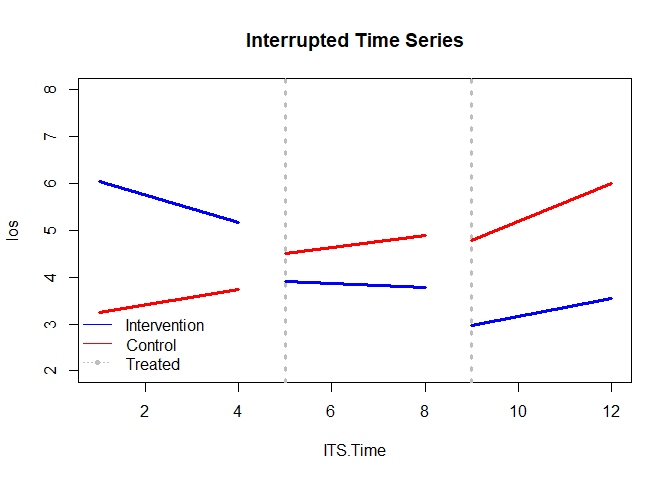
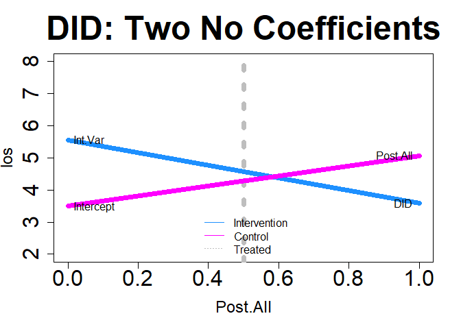
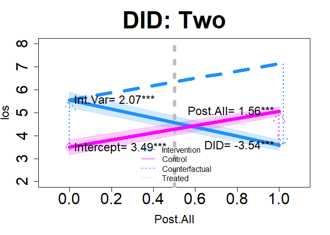
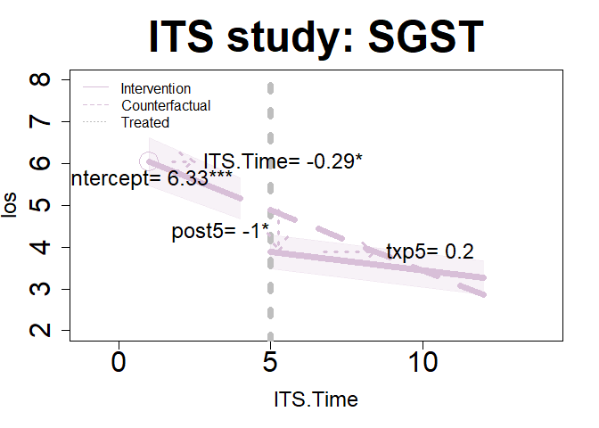
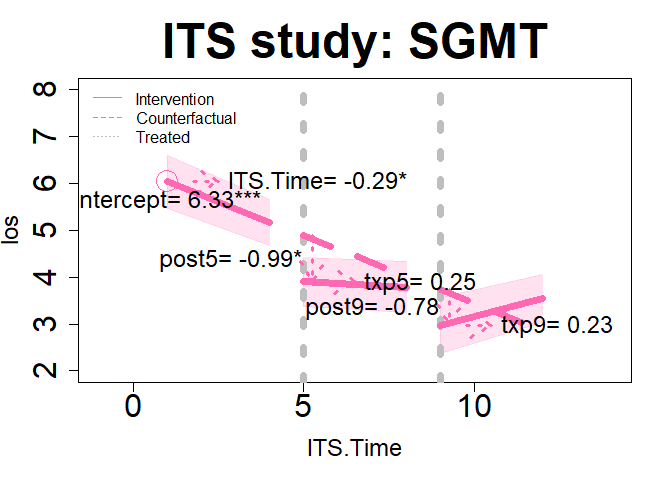
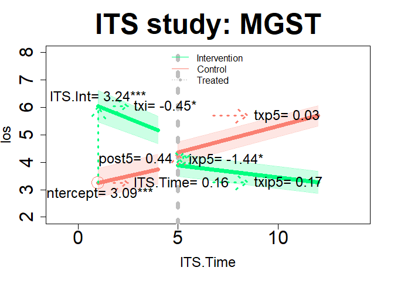
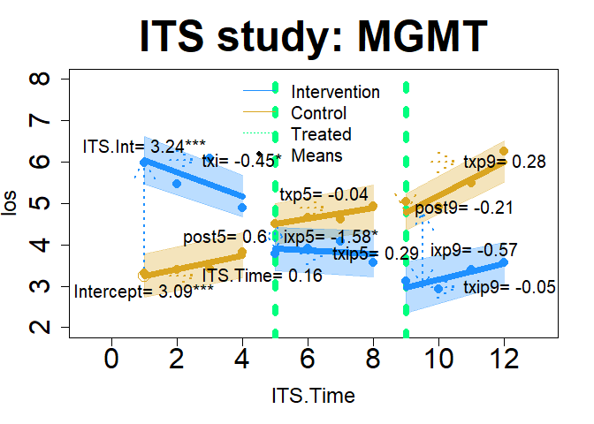

<!-- README.md is generated from README.Rmd. Please edit that file -->

# Healthcare Analysis Methods (ham)

<!-- badges: start -->
<!-- badges: end -->

The goal of ham is to provide different modeling approaches to
evaluating healthcare programs (or programs in other fields) with
regression analysis. This includes standard regression methods like
linear (OLS) and logistic regression. And ham adds options for
differences-in-differences models as well as interrupted time-series
analysis. DID and ITS models offer options for causal modeling. What is
unique about ham is that it creates datasets with constructed variables
for DID and ITS models, optionally can add top coded outcome variables,
propensity scores, and provides some interpretation of model results.
Additionally, Cronbach’s alpha can be calculated for such things as
patient surveys.


## Installation

You can install the development version of ham from
[GitHub](https://github.com/) with:

``` r
# install.packages("devtools")
devtools::install_github("szuniga07/ham")
```

## Cronbach’s alpha example

An example of calculating Cronbach’s alpha:

``` r
library(ham)
alpha(items=c("i1","i2","i3","i4","i5"), data=cas)
#> Scale statistics 
#> Cronbach's alpha   = 0.919 
#> Mean               = 3.772 
#> Variance           = 0.453 
#> Standard Deviation = 0.673 
#> Items              = 5 
#>  
#> Item statistics 
#>    Mean Variance Std. Dev.
#> i1 3.50    0.434     0.659
#> i2 3.81    0.681     0.825
#> i3 3.88    0.652     0.808
#> i4 3.82    0.594     0.770
#> i5 3.85    0.634     0.796
#> 
#> Scale statistics if item deleted 
#>    Alpha  Mean Variance Std. Dev.
#> i1 0.930 3.840    0.528     0.727
#> i2 0.891 3.763    0.436     0.660
#> i3 0.883 3.745    0.433     0.658
#> i4 0.910 3.760    0.472     0.687
#> i5 0.885 3.752    0.439     0.662
#> 
#> Sample 
#> Total    = 100 
#> Valid    = 100 
#> Excluded = 0

## Interpret the results
interpret(alpha(items=c("i1","i2","i3","i4","i5"), data=cas))
#> Interpretations: Alpha 
#> ---------------------- 
#> Your 5 item scale has a Cronbach's alpha of 0.92. This is 
#> generally considered as being in the 'excellent' range. 
#> 
#> The scale mean is 3.77 and has a standard deviation of 0.67. 
#> 
#> Removing one of these item(s): i1, can improve the Cronbach's 
#> alpha in a new scale to a higher level than the current alpha 
#> based on all items. 
#> 
#> 0 row(s) of data excluded from the analysis because of missing 
#> data.
```

## 1. Introduction

This is the ham package on healthcare analysis methods. This package can
help when performing program evaluations or intervention studies in
healthcare. Or simply to test if a program has an impact on an outcome
of interest.

ham can help with research or evaluation studies. When working in
healthcare systems, multi-site evaluations can strongly resemble
research studies and commonly use regression methods. For an
introduction to evaluation, please see the reference below.

Patton, M. Q. (1997). Utilization-focused evaluation: The new century
text (3rd ed.). Thousand Oaks, CA: Sage Publications

What is unique about ham, is that it provides options for running
standard linear or ordinary least squares (OLS) and logistic regression
as well as methods used in causal modeling such as
differences-in-differences (DID) and interrupted time series analysis
(ITS). It also optionally makes data with the newly created variables
(i.e., this saves you time).

This vignette will introduce ham’s features in the following functions:
\* alpha: Conduct Cronbach’s alpha on scale items (e.g., survey
questions). \* assess: Perform various regression methods (OLS,
logistic, differences-in-differences, and interrupted time series) \*
importance: Rank variable importance from regression coefficients using
the partial chi-square statistic. \* interpret: Provides simple
coefficient interpretations. This is a helpful reminder, especially as
models have increased coefficients (e.g., ITS). \* There are also
printing and plotting options to help review your results.

Below will cover 3 sections with examples of the different features
along the way.

## 2. Linear and logistic regression

The example dataset has common variables found in program evaluation or
intervention studies (I’ll refer to both as a ‘study’), there are
various outcome and predictor variables (or response and explanatory
variables or dependent and independent variables or other names common
in your field). In these studies, we try to assess the impact of the
predictors on the outcome. We often use treatment and control groups to
asses a healthcare program or intervention’s impact on our key outcome
variable of interest. Because of multiple stakeholders, we often conduct
these studies with multiple outcomes to help answer the multiple
stakeholder’s questions.

A common approach to answering study questions is using a regression to
test a treatment effect while controlling for other covariates.

Here are OLS and logistic regression example using assess() on the
mtcars data. These use lm() and glm() found in R’s stats package.

### OLS or linear regression

``` r
summary(assess(hp ~ mpg+wt, data=mtcars, regression="ols")$model)
#> 
#> Call:
#> stats::lm(formula = primary_formula, data = combined_df)
#> 
#> Residuals:
#>    Min     1Q Median     3Q    Max 
#> -59.42 -30.75 -12.07  24.82 141.84 
#> 
#> Coefficients:
#>             Estimate Std. Error t value Pr(>|t|)   
#> (Intercept)  349.287    103.509   3.374  0.00212 **
#> mpg           -9.417      2.676  -3.519  0.00145 **
#> wt            -4.168     16.485  -0.253  0.80217   
#> ---
#> Signif. codes:  0 '***' 0.001 '**' 0.01 '*' 0.05 '.' 0.1 ' ' 1
#> 
#> Residual standard error: 44.65 on 29 degrees of freedom
#> Multiple R-squared:  0.6033, Adjusted R-squared:  0.576 
#> F-statistic: 22.05 on 2 and 29 DF,  p-value: 1.505e-06
```

### Logistic regression

``` r
summary(assess(formula=vs~mpg+wt+hp, data=mtcars, regression="logistic")$model)
#> 
#> Call:
#> stats::glm(formula = primary_formula, family = binomial(link = "logit"), 
#>     data = combined_df)
#> 
#> Coefficients:
#>              Estimate Std. Error z value Pr(>|z|)  
#> (Intercept) -10.61945   16.52453  -0.643   0.5205  
#> mpg           0.50291    0.48656   1.034   0.3013  
#> wt            3.87749    3.19255   1.215   0.2245  
#> hp           -0.09318    0.04318  -2.158   0.0309 *
#> ---
#> Signif. codes:  0 '***' 0.001 '**' 0.01 '*' 0.05 '.' 0.1 ' ' 1
#> 
#> (Dispersion parameter for binomial family taken to be 1)
#> 
#>     Null deviance: 43.860  on 31  degrees of freedom
#> Residual deviance: 14.748  on 28  degrees of freedom
#> AIC: 22.748
#> 
#> Number of Fisher Scoring iterations: 8

## Interpret the results
interpret(assess(formula=vs~mpg+wt+hp, data=mtcars, regression="logistic")
          )$model
#> Interpretations: Model 
#> ---------------------- 
#> These estimates tell you about the relationship between the 
#> independent variables and the dependent variable. These estimates 
#> tell the amount of change in outcome scores that would be 
#> predicted by a 1 unit increase in the predictor. 
#> 
#> The following predictor variable(s) have coefficient(s) 
#> significantly different from 0 using an alpha of 0.05:
#> hp 
#> 
#> For every 1 unit increase in these predictor variables,
#> vs is predicted to increase by the value of the 
#> coefficient, holding all other variables constant. The following 
#> predictor variable(s) have positive coefficient(s) that 
#> increase the predicted value of the outcome: 
#> No positive coefficients in your model were significant. 
#> 
#> For every 1 unit increase in these predictor variables,
#> vs is predicted to decrease by the value of the 
#> coefficient, holding all other variables constant. The following 
#> predictor variable(s) have negative coefficient(s) that 
#> decrease the predicted value of the outcome: 
#> hp 
#> 
#> There is no R2 information provided.
```

ham can topcode the outcome and create a propensity score variable. Here
is an example using the artificially created hosprog data with hospital
stay cost as the outcome with a novel hospital program/intervention
binary indicator and a 12 month time variable. The option for new data
being returned is specified with newdata=TRUE.

### OLS topcoding

top coding cost at \$17,150 and propensity score based on age, female
indicator, and a health risk probability score.

``` r
m1 <- assess(formula=cost ~ month * program, data=hosprog, intervention = "program",
regression="ols", topcode=17150, propensity=c("female","age","risk"),
newdata=TRUE)
```

### Model results

``` r
summary(m1$model)
#> 
#> Call:
#> stats::lm(formula = primary_formula, data = combined_df)
#> 
#> Residuals:
#>     Min      1Q  Median      3Q     Max 
#> -6747.9 -2118.0  -602.6  1871.0 10440.7 
#> 
#> Coefficients:
#>                Estimate Std. Error t value Pr(>|t|)    
#> (Intercept)    17611.14    1884.32   9.346  < 2e-16 ***
#> month            456.31      47.25   9.658  < 2e-16 ***
#> program         5562.45     511.54  10.874  < 2e-16 ***
#> pscore        -22817.69    3807.79  -5.992 3.28e-09 ***
#> month:program   -923.09      68.07 -13.561  < 2e-16 ***
#> ---
#> Signif. codes:  0 '***' 0.001 '**' 0.01 '*' 0.05 '.' 0.1 ' ' 1
#> 
#> Residual standard error: 3150 on 715 degrees of freedom
#> Multiple R-squared:  0.2404, Adjusted R-squared:  0.2362 
#> F-statistic: 56.58 on 4 and 715 DF,  p-value: < 2.2e-16
```

Descriptive statistics on newly created variables and the original cost
as a comparison. top.cost is the topcoded cost variable.

``` r
summary(m1$newdata[, c( "cost","top.cost", "pscore")])
#>       cost          top.cost         pscore      
#>  Min.   : 1483   Min.   : 1483   Min.   :0.4226  
#>  1st Qu.: 6410   1st Qu.: 6410   1st Qu.:0.4649  
#>  Median : 8639   Median : 8639   Median :0.4900  
#>  Mean   : 9348   Mean   : 9215   Mean   :0.4889  
#>  3rd Qu.:11487   3rd Qu.:11487   3rd Qu.:0.5117  
#>  Max.   :27540   Max.   :17150   Max.   :0.5547
```

### importance

We can examine variable importance based on partial chi-square (i.e.,
which variables explain the outcome the most).

``` r
importance(m1$model)
#>               X    Chi.Sq d.f.      p.value
#> 1         month 184.01329    2 1.101596e-40
#> 2       program 190.33590    2 4.667501e-42
#> 3        pscore  35.90859    1 2.067946e-09
#> 4 month:program 183.89852    1 6.827526e-42
```

### Plot importance

We can examine variable importance to see a ranking of variables with a
graph. The hospital program has the highest rank, variables highlighted
in red are statistically significant.

``` r
#Consider using these graphical parameters
par(mar=c(4.2, 2, 3.5, 3))
par(oma = c(0, 0, 0, 3))
plot(importance(m1$model))
```


Topcoding can be applied to any model. Propensity scores can be created
for any model except the single group interrupted time series because
there is no control group (i.e. intervention group only).

## 3. Differences-in-Differences

DID can be used on binary or continuous outcome variables. Below is an
example using the hosprog data with length of stay as the outcome and
the created DID variables as the predictors, use ‘.’ on the right-hand
side of the formula to indicate only the created variables will be used.
Replace ‘.’ with any additional selected variables. The newly created
DID variables will be added in all DID models. This model has a pre/post
design (i.e., there are only 2 distinct time points) by selecting:
did=“two”, with post starting at month 5.

### DID model 1

``` r
dm1 <- assess(formula= los ~ ., data=hosprog, intervention = "program",
              int.time="month", treatment= 5, did="two")
```

### View DID model results

``` r
summary(dm1$DID)
#> 
#> Call:
#> stats::lm(formula = DID_formula, data = combined_df)
#> 
#> Residuals:
#>     Min      1Q  Median      3Q     Max 
#> -3.6883 -1.1424 -0.2642  0.8139  8.8260 
#> 
#> Coefficients:
#>             Estimate Std. Error t value Pr(>|t|)    
#> (Intercept)   3.4940     0.1646  21.229  < 2e-16 ***
#> Post.All      1.6264     0.1989   8.178 1.32e-15 ***
#> Int.Var       2.0664     0.2343   8.820  < 2e-16 ***
#> DID          -3.5702     0.2837 -12.583  < 2e-16 ***
#> ---
#> Signif. codes:  0 '***' 0.001 '**' 0.01 '*' 0.05 '.' 0.1 ' ' 1
#> 
#> Residual standard error: 1.773 on 716 degrees of freedom
#> Multiple R-squared:  0.189,  Adjusted R-squared:  0.1856 
#> F-statistic: 55.62 on 3 and 716 DF,  p-value: < 2.2e-16
```

### Coefficient interpretations

``` r
interpret(dm1)$did
#> Interpretations: DID 
#> -------------------- 
#> The intercept represents the mean los value of the 
#> control group at the baseline period (Time 1): 3.494. 
#> 
#> Post.All is the change in the control group's los 
#> value in the 2nd time period (Time 2). There was a 
#> significant increase for the control group 
#> at time 2: 1.626. 
#> 
#> Int.Var is the difference between the intervention 
#> and control group at the baseline period (Time 1). The 
#> intervention group had a significant increase in the 
#> mean los value compared to the control group: 2.066. 
#> 
#> DID estimates the average treatment effect on the 
#> treated group (ATET). This interaction represents the 
#> difference in the trend differences for the intervention and 
#> control groups: 
#> (Int. Time 2 - Int. Time 1) - (Ctl. Time 2 - Ctl. Time 1) = -3.57.  
#> In other words, there was a significant decrease in the 
#> mean los trend by -3.57 for the intervention group. 
#> 
#> If there are additional variables in the model then the coefficients 
#> above represent the effects after controlling for the other variables.
```

### DID model 2

This model allows for more than 2 time points. It allows for monthly
increments by selecting did=“many”.

``` r
dm2 <- assess(formula= los ~ ., data=hosprog, intervention = "program",
              int.time="month", treatment= 5, did="many")
```

### View DID model 2 results

``` r
summary(dm2$DID)
#> 
#> Call:
#> stats::lm(formula = DID_formula, data = combined_df)
#> 
#> Residuals:
#>     Min      1Q  Median      3Q     Max 
#> -3.7894 -1.2339 -0.2911  0.8672  9.0804 
#> 
#> Coefficients:
#>             Estimate Std. Error t value Pr(>|t|)    
#> (Intercept)  4.14486    0.16093  25.756  < 2e-16 ***
#> Period       0.11963    0.02389   5.008 6.92e-07 ***
#> DID          0.10064    0.47605   0.211 0.832626    
#> DID.Trend   -0.19323    0.05590  -3.457 0.000579 ***
#> ---
#> Signif. codes:  0 '***' 0.001 '**' 0.01 '*' 0.05 '.' 0.1 ' ' 1
#> 
#> Residual standard error: 1.848 on 716 degrees of freedom
#> Multiple R-squared:  0.1184, Adjusted R-squared:  0.1148 
#> F-statistic: 32.07 on 3 and 716 DF,  p-value: < 2.2e-16
```

### Get coefficient interpretations

``` r
interpret(dm2)$did
#> Interpretations: DID 
#> -------------------- 
#> The intercept represents the starting point of the control 
#> group's trend line at the baseline period (Time 1): 4.145. 
#> 
#> Period is the change in the control group's los value trend 
#> line after the baseline period. There was a significant increase 
#> for the control group after the baseline period: 0.12. 
#> 
#> DID estimates the difference in mean overall level between 
#> the intervention and both the non-intervention period/group. 
#> In other words, there was a non-significant increase in the 
#> mean los by 0.101 for the intervention group. 
#> 
#> DID.Trend is the difference in the intervention group's 
#> trend line after the intervention period started (> Time 1). 
#> The intervention group had a significant decrease in trend 
#> of the mean los by -0.193 after the intervention started. 
#> 
#> If there are additional variables in the model then the coefficients 
#> above represent the effects after controlling for the other variables.
```

We can also use DID on binary outcomes like hospital re-admission within
30-days.

``` r
dm3 <- assess(formula= rdm30 ~ ., data=hosprog, intervention = "program",
              int.time="month", treatment= 5, did="two")
```

### View DID model 3 results

``` r
summary(dm3$DID)
#> 
#> Call:
#> stats::lm(formula = DID_formula, data = combined_df)
#> 
#> Residuals:
#>      Min       1Q   Median       3Q      Max 
#> -0.31858 -0.26984 -0.07113 -0.06034  0.93966 
#> 
#> Coefficients:
#>             Estimate Std. Error t value Pr(>|t|)    
#> (Intercept)  0.06034    0.03410   1.770   0.0772 .  
#> Post.All     0.20950    0.04120   5.085 4.71e-07 ***
#> Int.Var      0.25824    0.04854   5.321 1.39e-07 ***
#> DID         -0.45695    0.05878  -7.774 2.65e-14 ***
#> ---
#> Signif. codes:  0 '***' 0.001 '**' 0.01 '*' 0.05 '.' 0.1 ' ' 1
#> 
#> Residual standard error: 0.3672 on 716 degrees of freedom
#> Multiple R-squared:  0.08261,    Adjusted R-squared:  0.07877 
#> F-statistic: 21.49 on 3 and 716 DF,  p-value: 2.45e-13
```

Significant DID effect showing reduced re-admissions

## 4. Interrupted Time Series

ITS lets us look at trends for 1 or 2 groups such as an
intervention/treatment group without a control group or both a treatment
and control group. And we have the option of one or more treatment
periods (or interruptions). This gives us 4 options that can be
specified using the interrupt and its= arguments.

Below are examples using the hosprog data for the patient survey and
death within 30-days. The dataset hosp1 will be used for the single
group examples.

We begin by looking at a single group with a single
interruption/treatment period and assessing their survey scores. We
specify it with: interrupt= 5 and its=“one”.

### ITS model 1

``` r
im11 <- assess(formula=los ~ ., data=hosp1, intervention = "program",
               int.time="month", interrupt= 5, its="one")
```

### View ITS model 1 results

``` r
summary(im11$ITS)
#> 
#> Call:
#> stats::lm(formula = ITS_formula, data = combined_df)
#> 
#> Residuals:
#>     Min      1Q  Median      3Q     Max 
#> -3.7673 -1.1134 -0.3565  0.5679  9.0804 
#> 
#> Coefficients:
#>             Estimate Std. Error t value Pr(>|t|)    
#> (Intercept)   6.3299     0.4131  15.323   <2e-16 ***
#> ITS.Time     -0.2889     0.1429  -2.022   0.0439 *  
#> post5        -1.0081     0.4206  -2.397   0.0171 *  
#> txp5          0.2153     0.1503   1.432   0.1530    
#> ---
#> Signif. codes:  0 '***' 0.001 '**' 0.01 '*' 0.05 '.' 0.1 ' ' 1
#> 
#> Residual standard error: 1.71 on 348 degrees of freedom
#> Multiple R-squared:  0.2331, Adjusted R-squared:  0.2265 
#> F-statistic: 35.25 on 3 and 348 DF,  p-value: < 2.2e-16
```

### interpret coefficients

``` r
interpret(im11)$its
#> Interpretations: ITS 
#> -------------------- 
#> Note: Variable names below based on time points (or 'interruptions') 
#> won't match identically with the output (e.g., if time 1 = 12 months, 
#> the corresponding variables are post1 = post12). 
#> This analysis is for a one-group, single intervention period (interruption). 
#> 
#> Intercept is 6.33 and the starting value of the trend 
#> for the intervention group. 
#> 
#> ITS.Time is -0.289 and the slope prior to intervention. 
#> The coefficient is significant. 
#> 
#> post1 is -1.008 and the immediate shift in the trend line 
#> after the intervention start (e.g., 1st year of intervention). 
#> The coefficient is significant. 
#> 
#> txp1 is 0.215 and the difference between pre- and 
#> post-intervention slopes (e.g., change in the pre-intervention 
#> slope). The coefficient is non-significant. 
#> 
#> Summary: The results show that after the start of the intervention, 
#> there was a non-significant change in the los trend. This gives 
#> a total post-intervention trend in the los of -0.074 
#> over time (i.e., the total combined value of change not the 
#> change relative to pre-intervention). 
#> 
#> If there are additional variables in the model then the coefficients 
#> above represent effects after controlling for the other variables.
```

There is a second key period of interest at month 9 which is specified
with interrupt= c(5, 9) and its=“one”

### ITS model 2

``` r
im12 <- assess(formula=los ~ ., data=hosp1, intervention = "program",
               int.time="month", interrupt= c(5, 9), its="one")
```

### View ITS model 2 results

``` r
summary(im12$ITS)
#> 
#> Call:
#> stats::lm(formula = ITS_formula, data = combined_df)
#> 
#> Residuals:
#>     Min      1Q  Median      3Q     Max 
#> -3.7673 -1.1092 -0.2717  0.6124  8.7874 
#> 
#> Coefficients:
#>             Estimate Std. Error t value Pr(>|t|)    
#> (Intercept)   6.3299     0.4109  15.406   <2e-16 ***
#> ITS.Time     -0.2889     0.1421  -2.033   0.0428 *  
#> post5        -1.0165     0.4503  -2.257   0.0246 *  
#> txp5          0.2917     0.1991   1.465   0.1438    
#> post9        -0.9232     0.4793  -1.926   0.0549 .  
#> txp9          0.2298     0.2006   1.146   0.2527    
#> ---
#> Signif. codes:  0 '***' 0.001 '**' 0.01 '*' 0.05 '.' 0.1 ' ' 1
#> 
#> Residual standard error: 1.7 on 346 degrees of freedom
#> Multiple R-squared:  0.2457, Adjusted R-squared:  0.2348 
#> F-statistic: 22.54 on 5 and 346 DF,  p-value: < 2.2e-16
```

We continue with comparing the intervention and control groups on their
survey scores which is specified with interrupt= 5 and its=“two”.

### ITS model 3

``` r
im21 <- assess(formula=los ~ ., data=hosprog, intervention = "program",
               int.time="month", interrupt= 5, its="two")
```

### View ITS model 3 results

``` r
summary(im21$ITS)
#> 
#> Call:
#> stats::lm(formula = ITS_formula, data = combined_df)
#> 
#> Residuals:
#>     Min      1Q  Median      3Q     Max 
#> -3.7673 -1.1599 -0.2980  0.8575  9.0804 
#> 
#> Coefficients:
#>             Estimate Std. Error t value Pr(>|t|)    
#> (Intercept)  3.08956    0.39373   7.847 1.57e-14 ***
#> ITS.Time     0.16346    0.14503   1.127   0.2601    
#> ITS.Int      3.24031    0.57707   5.615 2.82e-08 ***
#> txi         -0.45232    0.20571  -2.199   0.0282 *  
#> post5        0.45770    0.45100   1.015   0.3105    
#> txp5         0.04517    0.15291   0.295   0.7678    
#> ixp5        -1.46578    0.62283  -2.353   0.0189 *  
#> txip5        0.17009    0.21667   0.785   0.4327    
#> ---
#> Signif. codes:  0 '***' 0.001 '**' 0.01 '*' 0.05 '.' 0.1 ' ' 1
#> 
#> Residual standard error: 1.746 on 712 degrees of freedom
#> Multiple R-squared:  0.2177, Adjusted R-squared:   0.21 
#> F-statistic:  28.3 on 7 and 712 DF,  p-value: < 2.2e-16
```

We have an interest in a 2nd interruption at month 9, which is specified
with interrupt= c(5, 9) and its=“two”.

### ITS model 4

``` r
im22 <- assess(formula=los ~ ., data=hosprog, intervention = "program",
               int.time="month", interrupt= c(5, 9), its="two")
```

### View ITS model 4 results

``` r
summary(im22$ITS)
#> 
#> Call:
#> stats::lm(formula = ITS_formula, data = combined_df)
#> 
#> Residuals:
#>     Min      1Q  Median      3Q     Max 
#> -3.7673 -1.1580 -0.2756  0.8797  8.7874 
#> 
#> Coefficients:
#>             Estimate Std. Error t value Pr(>|t|)    
#> (Intercept)  3.08956    0.39247   7.872 1.31e-14 ***
#> ITS.Time     0.16346    0.14456   1.131   0.2586    
#> ITS.Int      3.24031    0.57522   5.633 2.55e-08 ***
#> txi         -0.45232    0.20505  -2.206   0.0277 *  
#> post5        0.60967    0.47359   1.287   0.1984    
#> txp5        -0.02375    0.20738  -0.115   0.9089    
#> ixp5        -1.62620    0.66085  -2.461   0.0141 *  
#> txip5        0.31548    0.29077   1.085   0.2783    
#> post9       -0.20282    0.49371  -0.411   0.6813    
#> txp9         0.28502    0.20012   1.424   0.1548    
#> ixp9        -0.72043    0.69600  -1.035   0.3010    
#> txip9       -0.05522    0.28668  -0.193   0.8473    
#> ---
#> Signif. codes:  0 '***' 0.001 '**' 0.01 '*' 0.05 '.' 0.1 ' ' 1
#> 
#> Residual standard error: 1.74 on 708 degrees of freedom
#> Multiple R-squared:  0.227,  Adjusted R-squared:  0.215 
#> F-statistic:  18.9 on 11 and 708 DF,  p-value: < 2.2e-16
```

### View a partial prediction plot

``` r
plot(x=im22, y="ITS", ylim=c(2, 8), add.legend="bottomleft")
```



We can also perform an ITS on binary outcomes like death within 30-days.
We will examine an intervention and control group at months 5 and 9,
which is specified with interrupt= c(5, 9) and its=“two”.

### ITS model 5

``` r
id22 <- assess(formula=death30 ~ ., data=hosprog, intervention = "program",
               int.time="month", interrupt= c(5, 9), its="two")
```

### View ITS model 5 results

``` r
summary(id22$ITS)
#> 
#> Call:
#> stats::lm(formula = ITS_formula, data = combined_df)
#> 
#> Residuals:
#>      Min       1Q   Median       3Q      Max 
#> -0.28088 -0.17307 -0.09251 -0.05100  0.95354 
#> 
#> Coefficients:
#>              Estimate Std. Error t value Pr(>|t|)  
#> (Intercept)  0.082862   0.075225   1.102   0.2710  
#> ITS.Time    -0.009101   0.027708  -0.328   0.7427  
#> ITS.Int      0.181411   0.110253   1.645   0.1003  
#> txi         -0.013699   0.039302  -0.349   0.7275  
#> post5        0.195263   0.090774   2.151   0.0318 *
#> txp5        -0.023922   0.039749  -0.602   0.5475  
#> ixp5        -0.294530   0.126666  -2.325   0.0203 *
#> txip5        0.067477   0.055733   1.211   0.2264  
#> post9        0.180356   0.094631   1.906   0.0571 .
#> txp9        -0.026088   0.038357  -0.680   0.4966  
#> ixp9        -0.322297   0.133403  -2.416   0.0159 *
#> txip9        0.040490   0.054948   0.737   0.4614  
#> ---
#> Signif. codes:  0 '***' 0.001 '**' 0.01 '*' 0.05 '.' 0.1 ' ' 1
#> 
#> Residual standard error: 0.3336 on 708 degrees of freedom
#> Multiple R-squared:  0.05319,    Adjusted R-squared:  0.03848 
#> F-statistic: 3.616 on 11 and 708 DF,  p-value: 5.427e-05
```

### interpret ITS model 5 results

``` r
interpret(id22)$its
#> Interpretations: ITS 
#> -------------------- 
#> Note: Variable names below based on time points (or 'interruptions') 
#> won't match identically with the output (e.g., if time 1 = 12 months, 
#> This analysis is for a two-group, single intervention period (interruption). 
#> Positive values indicate higher intervention group values and vice-versa for: 
#> post1, txp1, ixp1, txip1, post2, txp2, ixp2, txip2. 
#> 
#> Intercept is 0.083 and the starting value of the trend for the 
#> control group. 
#> 
#> ITS.Time is -0.009 and the control group's slope prior to intervention. 
#> The coefficient is non-significant. 
#> 
#> ITS.Int is 0.181 and the difference in the level between intervention 
#> and control group prior to intervention 1 (intervention - control). 
#> The coefficient is non-significant. 
#> 
#> txi is -0.014 and the difference between the intervention and 
#> control group's pre-intervention slopes (intervention - control). 
#> The coefficient is non-significant. 
#> 
#> post1 is 0.195 and the immediate shift in the control group 
#> trend line after the 1st intervention start. The coefficient is 
#> significant. 
#> 
#> txp1 is -0.024 and the difference between pre- and post-intervention 
#> control group slopes (e.g., change in the pre-intervention 
#> slope). The coefficient is non-significant. 
#> 
#> ixp1 is -0.295 and the difference between the intervention and 
#> control groups (intervention - control) in the period immediately 
#> after the intervention started (e.g., 1st year of intervention 1). 
#> The coefficient is significant. 
#> 
#> txip1 is 0.067 and non-significant. This is the difference in both 
#> group's slope changes since pre-intervention (pre-slopes compared 
#> to post-slopes). For example, both have pre-intervention slopes 
#> of 2, the control group's slope remained the same, therefore the 
#> post 1st intervention slope is 0. And the intervention group's slope 
#> increased by 2, then txip1 = 2 (= 2 - 0). 
#> 
#> post2 is 0.18 and the immediate shift in the control group 
#> trend line after the 2nd intervention start. The coefficient is 
#> non-significant. 
#> 
#> txp2 is -0.026 and the difference between 1st and 2nd intervention 
#> control group slopes (e.g., change in the 1st intervention 
#> slope). The coefficient is non-significant. 
#> 
#> ixp2 is -0.322 and the difference between the intervention and 
#> control groups (intervention - control) in the period immediately 
#> after the 2nd intervention started (e.g., 1st year of intervention 2). 
#> The coefficient is significant. 
#> 
#> txip2 is 0.04 and non-significant. This is the difference in both group's 
#> slope changes since the 1st intervention (1st intervention slope compared 
#> to the 2nd). For example, both have 1st intervention slopes of 2, the control 
#> group's slope remained the same, therefore the 2nd intervention slope is 0. And 
#> the intervention group's slope increased by 2, then txip2 = 2 (= 2 - 0). 
#> 
#> Summary 1: For the 1st intervention period, the results show that the 
#> intervention group's non-significant shift in death30, 
#> post 1st intervention was 0.021. The control group's non-significant 
#> shift in death30, post 1st intervention was -0.033. The non-significant 
#> difference between both groups is 0.054. 
#> 
#> Summary 2: For the 2nd intervention period, the results show that the 
#> intervention group's non-significant shift in death30, 
#> post 2nd intervention was 0.035. The control group's significant 
#> shift in death30, post 2nd intervention was -0.059. The significant 
#> difference between both groups is 0.094. 
#> 
#> If there are additional variables in the model then the coefficients 
#> above represent effects after controlling for the other variables.
```

<center>

### REVISIONS AND NEW ADDITIONS!

</center>

The following are corrections of errors and additions in the next
version of ham.

Errors corrected are for plot.assess only: 1) DID=“many” time 1 is no
longer the intercept and 2) ITS=“two” intercept is now correct.

Additions are for plot.assess only: 1) added some graphing parameters
and 2) added arrows and coefficient names to help visualize model
coefficients.

Examples of new plotting options are below.

<center>

## plot.assess update

</center>

### Differences-in-Differences

``` r
plot(dm1, "DID", add.legend="bottom", ylim=c(2, 8), main="DID: Two No Coefficients",
     col=c("dodgerblue","magenta"), lwd=7, cex=2, cex.axis=2, cex.lab=1.5,  cex.main=3, name=TRUE, )
```



``` r
plot(dm1, "DID", add.legend="bottom", xlim=c(-.1, 1.1), ylim=c(2, 8), main="DID: Two", col=c("dodgerblue","magenta"), lwd=7, cex=2, cex.axis=2, cex.lab=1.5,  cex.main=3, arrow=TRUE, xshift=c(.02), cex.text=1.5, coefs=TRUE, round.c=2 )
```



``` r
plot(dm2, "DID", add.legend="topleft", xlim=c(-.5, 12), ylim=c(2, 8), main="DID: Many", col=c("purple","green"), lwd=7, cex=3, cex.axis=2, cex.lab=1.5,  cex.main=3, arrow=TRUE, xshift=c(.25, .1), cex.text=1.5, coefs=TRUE, round.c=2 )
```


### Interrupted Time Series

``` r
plot(im11, "ITS", add.legend="topleft", xlim=c(-1, 14), ylim=c(2, 8), 
     main="ITS study: SGST", col="thistle", lwd=7, cex=3, cex.axis=2, cex.lab=1.5,  cex.main=3, arrow=TRUE, xshift=c(.25, .25), cex.text=1.5, coefs=TRUE, round.c=2 )
```



``` r
plot(im12, "ITS", add.legend="topleft", xlim=c(-1, 14), ylim=c(2, 8), 
     main="ITS study: SGMT", col="hotpink", lwd=7, cex=3, cex.axis=2, cex.lab=1.5,  cex.main=3, arrow=TRUE, xshift=c(.25, .25), cex.text=1.5, coefs=TRUE, round.c=2 )
```



``` r
plot(im21, "ITS", add.legend="top", xlim=c(-1, 14), ylim=c(2, 8), 
     main="ITS study: MGST", col=c("springgreen","salmon"), lwd=7, cex=3, cex.axis=2, cex.lab=1.5,  cex.main=3, arrow=TRUE, xshift=c(.25, .25), cex.text=1.5, coefs=TRUE, round.c=2, pos.text= list("post1"=2) )
```



Using all plot options

``` r
plot(im22, "ITS", add.legend="top", xlim=c(-.75, 13.1), ylim=c(2, 8), 
     main="ITS study: MGMT", col=c("dodgerblue","goldenrod"), lwd=7, cex=3, cex.axis=2, cex.lab=1.5,  cex.main=3, cex.legend=1.25, arrow=TRUE, xshift=c(0, .5), cex.text=1.25, name=F, coefs=TRUE, round.c=2, pos.text= list("txp1"=3, "post2"=4), tcol="springgreen")
```


