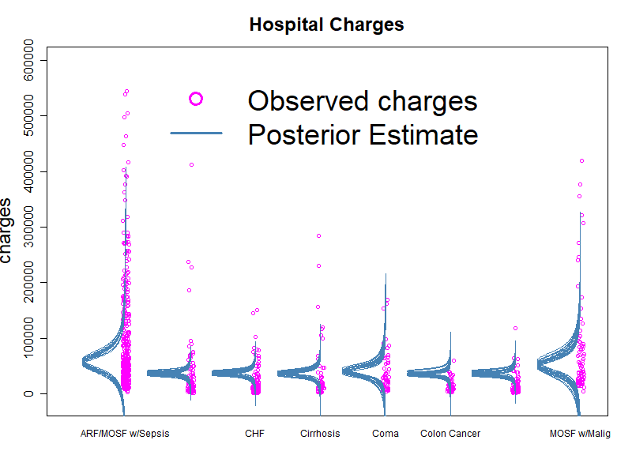

```{r, include = FALSE}
knitr::opts_chunk$set(
  collapse = TRUE,
  comment = "#>"
)
```

```{r setup}
library(ham)
```

```{r vlogo, echo=FALSE, out.width="30%", fig.align="center"}
knitr::include_graphics("logo.png") 
```

<br>

<center>
# Bayesian Analysis
</center>

Bayesian summaries and graphs are now available on ham. The Bayes and plot.Bayes functions will summarize and display Markov Chain Monte Carlo (MCMC) simulations that are stored as a list of matrix elements. For example, you may have saved 10,000 simulations as 4 chains that are stored in a list and may want to run standard simulation diagnostics like a traceplot. You can use ham's Bayes function to convert the 4 chains into a data frame that can be used to create a traceplot.

MCMC chains created in the coda package (e.g., through JAGS or Stan with a class of coda, matrix, array) can also be converted with the Bayes function.

The following sections will introduce the various commands in Bayes and plot.Bayes. We'll review it in terms of a common focus in health care, hospital length of stay (LOS).

If you are interested in Bayesian analysis and would like to learn more, I highly recommend John Kruschke's book, "Doing Bayesian Data Analysis: A Tutorial with R, JAGS, and Stan, Second Edition" as an excellent source of knowledge with comprehensive sections on putting the analysis into practice.

<br>

# 1. Introduction

This vignette will introduce ham's features in the following functions.

## Bayes()

The 'y' argument allows us to ouput results with these options--

* post: Creates a posterior summary for a parameter in the MCMC.

* multi: Creates a posterior summary of a hierarchical model for plots.

* target: Calculates the proportion of the distribution above specific probabilities or values.

* r2: Calculates Gelman's R^2 (see documentation).

* Dx: MCMC diagnostics from the autocorrelation factor, effective sample size, Monte Carlo standard error, and Gelman-Rubin statistic (shrink factor).

* mcmc: Returns the MCMC converted into a data frame which is required for all graphing options except when y= 'multi', Bayes() pre-processes the 'multi' output so no new new data is required. You can get your MCMC by specifying newdata=TRUE within Bayes().

## plot.Bayes()

There are similar plot options found in the 'y' argument.

* post: Graphs a posterior distribution or curve for a parameter in the MCMC.

* dxa: Graphs MCMC diagnostics for the autocorrelation factor and effective sample size.

* dxd: Graphs MCMC diagnostics for density plots of convergence such as the Monte Carlo standard error.

* dxg: Graphs MCMC diagnostics for the Gelman-Rubin statistic (shrink factor).

* dxt: Graphs MCMC diagnostics for traceplots.

* check: Plots posterior predictive checks for distributions on estimations or trend lines of regressions.

* multi: Graphs a posterior summary of a hierarchical model with 2 options of repeated measurements nested within individuals or individuals nested within organizations. For example, multiple blood tests for patients found within hospitals.

* target: Plot the calculated proportion of the distribution above specific probabilities or values using either the parameter estimate that represents the 'average' (i.e., graph from 'post') or the estimated distribution (i.e., graph from 'check').

This vignette will go in order of the sections in plot.Bayes since almost everything with Bayes() overlaps. And it will conclude with 'r2'. Most plot.Bayes() arguments are optional so the examples will begin with a 'bare bones' option that will help produce plots quickly and follow with more detailed graphs. Not all possible arguments are available with each 'y' option but many are, especially the relevant ones.

# 2. Diagnostics: 'dxa', 'dxd', 'dxg', 'dxt'

We have 2 options in reviewing diagnostics: 1) with graphs or 2) assessing the statistics. This code will first create a Bayes object that we can produce our graphs (because y='mcmc' by default) from a list of MCMC simulations. And we'll modify it later but for now, this produces an object we can start reviewing.

```{r Post0}
blos1 <- Bayes(x=losmcmc)
```

We'll start by reviewing our MCMC to assess how well the models ran. And this runs with the most basic code. Examine Bayesian model diagnostics for estimated length of stay (LOS).
Review autocorrelation factor, density plots, Gelman-Rubin statistic, and traceplots.

This uses the bare minimum code that will run, similar for each diagnostic plot.

<br>

Autocorrelation factor
```{r plotdx1, fig.dim = c(6, 4.5)}
plot(blos1, y="dxa", parameter="muOfY")
```

<br>

Density plots
```{r plotdx2, fig.dim = c(6, 4.5)}
plot(blos1, y="dxd", parameter="muOfY")
```

<br>

Gelman-Rubin statistic
```{r plotdx3, fig.dim = c(6, 4.5)}
plot(blos1, y="dxg", parameter="muOfY")
```

<br>

Traceplot
```{r plotdx4, fig.dim = c(6, 4.5)}
plot(blos1, y="dxt", parameter="muOfY")
```

A review of the diagnostics suggest that the model ran well.

### interpretations
The graphs are very helpful for reviewing the diagnostics but the interpretations are helpful in reviewing what information we gain from conducting the MCMC diagnostics. There are 3 types of information in the interpretation output.

* 1. General overview of the MCMC representativeness, accuracy, and efficiency.

* 2. Gelman-Rubin, ACF, ESS, and MCSE statistics about your parameter.

* 3. Additional background information.

For example, here's a review of the blos1 object:

```{r Diagnostics1}
blos2 <- Bayes(losmcmc, y="Dx", parameter="muOfY")
interpret(blos2$Diagnostics, digits=5)
```

<br>

# 3. Posterior summary: 'post' 

Posterior estimates of length of stay. First set up the Bayes object to convert the chains. We need, newdata=TRUE, to produce a graph later from our new MCMC data frame.

This uses the bare minimum code that will run and provide newdata to graph later. 

```{r Post1}
blos1 <- Bayes(x=losmcmc, y="post", parameter="muOfY", newdata=TRUE)
print(blos1$Posterior.Summary)
```

We can get standard posterior info from above with the 'x' and 'parameter' arguments but it can be helpful to view these results in a graph. Here we use a comparison value and a ROPE.

```{r plotPost101, fig.dim = c(6, 4.5)}
plot(x=blos1, y="post", parameter="muOfY", compare=4.5, rope=c(4,5), lcol= c("blue","red"),
bcol="goldenrod", HDItext=.3, main= "Summary of average LOS (muOfY)")
```

And we can calculate statistics that combine multiple parameters (e.g., calculate the mean difference between intervention and control groups and get Cohen's effect size in how large the difference is for binary outcomes). Here we get the coefficient of variation by dividing the standard deviation by the mean. We use the 'math' argument and arrange our parameters in the proper order. We only need the first 4 arguments but we'll add a little more.

```{r plotPost1, fig.dim = c(6, 4.5)}
plot(x=blos1, y="post", parameter=list("sigmaOfY", "muOfY" ),math="divide",
bcol="cyan", HDItext=.3, main= "Coefficient of Variation")
```


# 4a. Posterior Predictive Check: 'check'

On how well our model fits the data. Estimating center and spread for hospital length of stay. Generally, we only need the first 6 arguments below but we'll modify the plot. A model with a gamma likelihood would fit better but this will do for demonstration purposes.

```{r plotPPC1, fig.dim = c(6, 4.5)}
plot(x=blos1, y="check", type="n", data=hosprog, dv="los",
parameter=c("muOfY", "sigmaOfY"), breaks=30, cex.axis=1.3, lwd=3, xlab=NULL,
pline=20, vlim=c(-2, 20), xlim=c(-2, 20), add.legend="topright",
main="Length of Stay", cex.main=1.5, xpt=5, pcol="red", lcol="orange",
cex.legend=1, bcol="cyan")
```

Here is the bare minimum code that will run when 'type' is one of these-- ('n', 'ln', 'sn', 'w', 'g', 't'): 
plot(x=blos1, y="check", type="n", data=hosprog, dv="los", parameter=c("muOfY", "sigmaOfY"))

<br>
Here is an optional posterior predictive check when y='check' and type= 'taov'. This is used when you have a t distribution maximum likelihood with an ANOVA design (i.e., multiple groups) and you want a check for an estimated parameter (not the regression line). This side view is helpful in seeing the spread in values and how the heavy tails reach over those limits. The argument pct can extend the heavy tails in this side view (e.g., pct=0.99). You can also try this when doing a simple estimation with no multiple groups when y='check' and type= 'taov1', the '1' stands for 1 group only.

```{r anovaPlot, echo=FALSE, out.width="60%", fig.align="center"}
 
```

<br>

# 4b. Checking the regression trend line: 'check'

Now lets look at the trend of conc on CO2 uptake from the CO2 data.
Using a quadratic model with conc^2 would help and is an option in ham.
First, create the Bayes object.

```{r Check1}
bco2 <- Bayes(x=co2mcmc, y='mcmc', newdata=TRUE )
```

<br>

We generally only need the first 7 arguments below that will run when 'type' is one of these-- ('ol', 'oq','oc', 'lnl', 'lnq', 'lnc', 'logl', 'logq', 'logc'):

```{r plotPPC2, fig.dim = c(6, 4.5)}
plot(x=bco2, y="check", type="ol", data=CO2, dv="uptake", iv="conc",
parameter=c("b0","b1"), add.data="al", cex.axis=1.3, lwd=1.5, pline=50,
vlim=c(50, 1100), xlim=c(0, 1100), ylim=c(0, 50), cex=2, cex.lab=2,
pcol="magenta", cex.main=2,cex.legend=1.2,  add.legend="topleft",
lcol="steelblue")              #vlim lets me extrapolate a little
```

<br>


# 5. Hierarchical or Multilevel Model summary: 'multi' 

We generally only need the first 3 arguments below. But we'll subset
on 8 of 12 plants in the level 2 model (observations nested in plants)
and modify other settings.

This code does not run because there is no 'mcmc_sample' object but here is a general format.

bmulti0 <- Bayes(x=mcmc_sample, parameter=c("theta", "omega","omegaO"),
y="multi", type="bern", data=mydf, dv="upbin", iv= c("Plant", "Group"))

This code runs with an existing ham object. Here is the bare minimum code that will run:

plot(x=co2multi, y="multi", level=2)

We see below that there are solid and hollow triangles. The hollow triangles represent the observed data and the solid triangles represent the estimated parameters. We see signs of 'shrinkage' with the plant means being pulled over to the overall mean. The level of shrinkage is impacted by sample size and the distribution of the plant's uptake values. Groups with larger samples tend to have more pull on group estimates because the analysis borrows on the information provided by other groups when calculating each group's estimated rate.

```{r plotMulti1, fig.dim = c(6, 4.5)}
plot(x=co2multi, y="multi", level=2, aorder=FALSE,
subset= c("Qn2","Qn3","Qc3","Qc2","Mn3","Mn2","Mc2","Mc3"),
lcol="blue", pcol= c("red", "skyblue"), round.c=1, bcol="yellow",
xlim=c(-.1, 1), legend=NULL, add.legend="topright", lwd=3, cex.lab=1.2,
cex= 2, cex.main=1.25, cex.axis=.75, cex.legend=1.5, X.Lab=NULL)
```

<br>

And now the level 3 plot (observation in plants in Treatment by type groups). You'll notice that in both the graphs, there is a wide HDI band, partially due to only having a few groups at each level, here just 4 groups. Having more groups at the higher levels can help narrow our degree of uncertainty by providing more information.

```{r plotMulti2, fig.dim = c(6, 4.5)}
plot(x=co2multi, y="multi", level=3, aorder=FALSE, lcol="blue", pcol= c("green", "pink"),
round.c=1, bcol="lavender", xlim=c(-.1, 1), legend=NULL, add.legend="bottomleft", lwd=3, cex.lab =1.2, cex= 2, cex.main=1.25, cex.axis=.75, cex.legend=1.25, X.Lab=NULL)
```

<br>

# 6. Target setting: 'target'

Our administrators ask how far are we from our goals, they ask about future targets in increments of 5 points of probability or specific days. We can answer both.

The cumulative distribution function (CDF) can be defined for any distribution of a random variable X whether continuous, discrete, or neither. If you can define or calculate the CDF of X them, by using the rules of probability, you can find the probability of any event determined by X (Probability by Pitman, 1993, p. 311). 

The Bayes function will generate a distribution for each target value within the elements 'p', 'y', and if applicable, will return the mean of the beta distribution. If you think of a distribution of mass instead of probability the mean is the center of gravity. Think of a histogram of the distribution as a shape cut from a rigid material of constant thickness and density. The mean value is then a balance point for the histogram, you can place your finger below the mean and the shape would be balanced (Probability by Pitman, 1993, p. 162).

In other words, we can use our MCMC estimate with shape parameters to calculate the CDF and inverse CDF to determine the probability of the distribution lower than a certain value and the X value associated with a specific percentile. We can then use this to assist with the target setting process. Or if we simply wanted to calculate those values or interval of values, y='target' will help.  

We first find the point in the distribution that represents the appropriate center or 'average'. A good reference point is the 50th percentile which has equal probability above and below that point (i.e., where chances are '50/50' or 'fair'). 

Below is the full set of results for each target, use 'newdata=TRUE' for future plots.

```{r Target1}
btarget1 <- Bayes(x=losmcmc, y="target", type="n", parameter=c("muOfY","sigmaOfY"),
newdata=TRUE, targets=list(p=c(.35,.4,.45, .5, .55),  y=c(3,4), e= list(a=c(.35,.4,.45), b=.5))) 
print(btarget1$Target)
```

We can now review the results to identify targets that represent increments of 5 points of probability. This potentially may requires another 5 points of effort to achieve, however moving around a rate in the middle is generally easier than moving to rates that are in the extremes (e.g., 0% infections). Using Jacob Cohen's effect sizes can help in that understanding. Notice "High.Low.Interval", represents the proportion under the curve of the highest and lowest value for y, here 4-3= 1 day. 

We know a good place to start when setting targets is at a probability of 0.50. But how do we know where to suggest an alternative target? We can use Cohen's h effect size to understand what is a small, medium, or large effect size (0.20, 0.50, 0.80). These values can be generated with a 2 element list as e= list(a=c(.35,.4,.45), b= .5). This code will calculate effect sizes between 0.35 and 0.50, 0.40 and 0.50, 0.45 and 0.50. Cohen's h is a statistic that is independent of sample size and adjusted for the differences relative to 0.50 as well as the extremes of 0 and 1. 

For example, the raw difference of 0.10 between potential targets of 0.50 and 0.40 results in a Cohen's h effect size of 0.20, representing a small effect size. Some stakeholders may argue that the alternative target of 0.40 is too big of change while others may argue it is too small (i.e., context is important). 

Here is the bare minimum code that will run (if we want to print, newdata=TRUE is needed; displaying default center = 'mode'):

btarget1 <- Bayes(x=losmcmc, y="target", type="n", parameter=c("muOfY","sigmaOfY"),
targets=list(p=c(.35,.4,.45, .5, .55),  y=c(3,4)))

<br>

Target graph using a posterior predictive check, more intuitive. 

```{r plotTarget2, fig.dim = c(7.5, 4.5)}
plot(x=btarget1, y="target", type="n", data=hosprog, dv="los", breaks=30,
cex.axis=1.3, lwd=1.5, pline=20, vlim=c(1, 12), xlim=c(1, 9),
parameter=c("muOfY","sigmaOfY"), add.legend="right", main="Length of Stay",
cex.main=1.5, xpt=5, pcol="black", lcol="salmon", tgtcol="blue", bcol="gray90",
cex.legend=1.25, cex.text = 1.5)
```

<br>

Target graph using the basic option of placing a target over a specific parameter. In this case overlaying the info on the estimate of mode parameter to show how it relates to the center.

```{r plotTarget1, fig.dim = c(6, 4.5)}
plot(x=btarget1, y="target", type="n", lcol="purple", tgtcol="blue", xlim=c(3.5, 5))
```

Here is the bare minimum code that will run this option:
plot(x=btarget1, y="target", type="n")

<br>


# 7. Gelamn's R^2: 'r2' 

The regression model using Base R data, CO2: update ~ conc. This is the bare minimum code needed to run.

```{r R21}
bR2 <- Bayes(x=co2mcmc, y='r2', data=CO2, iv="uptake", parameter=c("b0", "b1", "sigma"))
# R^2
print(bR2$R2.Summary$R2)
# Variance of predicted outcome
print(bR2$R2.Summary$Variance.Pred.Y)      
# Variance of residuals
print(bR2$R2.Summary$Variance.Residuals)
# A few predicted outcome values
print(head(bR2$R2.Summary$yPRED))          
```

<br>

The Bayes object bR2 returns various information. We see this R^2 is quite low so this is definitely not a great model but we can return here once we've built a better model.


<br>
